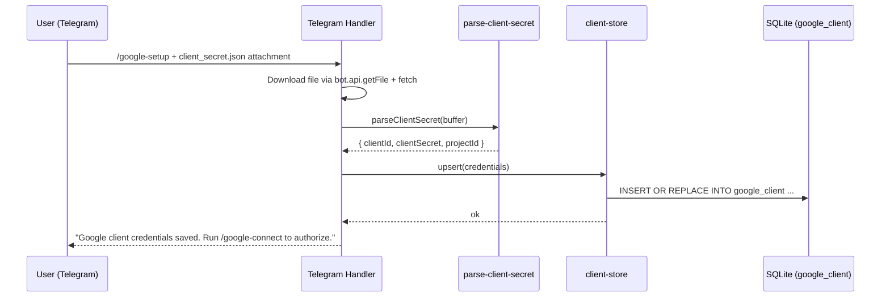
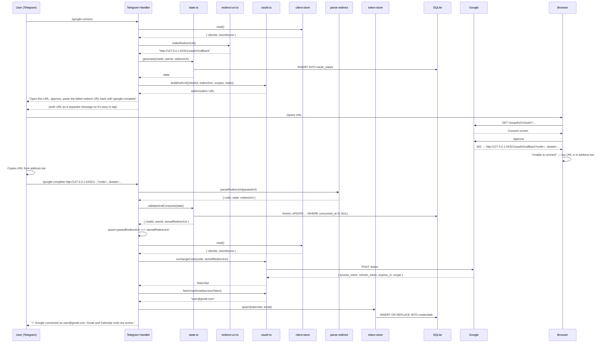

# tdmClaw — Google OAuth Technical Design Document

## Document Metadata

- Project: tdmClaw
- Document Type: Technical Design Document — Google OAuth Subsystem
- Version: 0.2
- Status: Draft
- Related Documents: `tdmClaw_TDD.md`, `tdmClaw_IP.md`, `tdmClaw_GoogleOAuth_IP.md`
- Target Runtime: Headless Ubuntu Server on Raspberry Pi
- Primary Language: TypeScript
- Primary Runtime: Node.js 22+

---

## 1. Purpose

This document defines the technical design for the Google OAuth subsystem in tdmClaw. It uses the same **loopback manual flow** that the gogcli CLI uses for its `--manual` mode: no HTTP server runs, no LAN hostname is required, and the entire OAuth flow happens through Telegram messages.

It covers:

- why the manual flow is correct for tdmClaw and why a hosted callback server is not needed
- how the three-message Telegram flow works (setup → connect → complete)
- handling user-uploaded `client_secret.json` files
- state management, CSRF protection, and token storage
- Gmail and Calendar API connector contracts
- security and error-handling requirements
- testing strategy

This document assumes familiarity with the main `tdmClaw_TDD.md`.

---

## 2. Context and Key Design Decision

### 2.1 The Manual Loopback Flow

Google's OAuth 2.0 specification for installed/desktop applications permits redirect URIs of the form `http://127.0.0.1:{port}/...` or `http://localhost:{port}/...` **without requiring anything to actually listen on that port**. The only requirement is that the user's browser follow the redirect — at which point the browser's address bar contains the full URL with the authorization code as a query parameter.

This is the foundation of gogcli's `--manual` flow. The CLI:

1. Asks the OS for a free loopback port (by opening a listener and immediately closing it — the port number is what it wanted, not the listener).
2. Builds a redirect URI of the form `http://127.0.0.1:{port}/oauth2/callback`.
3. Prints an auth URL and asks the user to visit it.
4. The browser follows the Google redirect, tries to reach `http://127.0.0.1:{port}/...`, and shows "connection refused" or "unable to connect."
5. The user copies the URL from their address bar and pastes it back into the CLI.
6. The CLI parses out the `code` and `state`, validates them, and exchanges the code for tokens.

**No server ever runs.** The redirect URI is a formatting convention, not an actual endpoint.

### 2.2 Why This Is Correct for tdmClaw

tdmClaw runs on a headless Raspberry Pi. The earlier design proposed hosting an HTTPS callback at a LAN hostname with a reverse proxy. This added substantial operational complexity (HTTPS cert, DNS entry, reverse proxy config, port exposure) for a once-in-a-while operation. The manual flow eliminates all of it:

- No HTTP server for OAuth
- No HTTPS termination
- No LAN hostname
- No firewall exposure
- No Google Cloud Console Authorized Redirect URI matching gymnastics (other than accepting that any `http://127.0.0.1:*` URI is valid for Desktop credentials)
- Works identically from any device on which the user can open a browser

The tradeoff is that the user performs one copy-paste operation per authorization. This is acceptable because authorization is a rare event (effectively one-time per Google account).

### 2.3 Credential Type: Desktop (Installed)

The Google Cloud project must use **OAuth 2.0 Client ID of type "Desktop app"** (shown as `installed` in the JSON file). Desktop credentials allow any `http://127.0.0.1:*` redirect URI without pre-registration. They produce a `client_secret.json` file with this shape:

```json
{
  "installed": {
    "client_id": "NNN-xxxx.apps.googleusercontent.com",
    "project_id": "my-project-123",
    "auth_uri": "https://accounts.google.com/o/oauth2/auth",
    "token_uri": "https://oauth2.googleapis.com/token",
    "auth_provider_x509_cert_url": "https://www.googleapis.com/oauth2/v1/certs",
    "client_secret": "GOCSPX-xxxxx",
    "redirect_uris": ["http://localhost"]
  }
}
```

The `redirect_uris` array in the file is informational — for Desktop credentials, Google accepts any loopback URI at runtime regardless of what's in the file.

### 2.4 User-Uploaded `client_secret.json`

The standard UX for Google OAuth in desktop-style tools is for the user to download `client_secret.json` from the Google Cloud Console and hand it to the application. tdmClaw supports this by accepting the file as a Telegram document attachment via `/google-setup`. The bot parses the JSON, extracts `client_id` and `client_secret`, and stores them in the `google_client` table. This removes the need for the user to edit a YAML config file and remove the tokens themselves later.

---

## 3. Design Goals

### 3.1 Functional Goals

1. Allow a user to fully authorize a Google account through Telegram without leaving Telegram (aside from opening the auth URL in a browser).
2. Accept the user's `client_secret.json` as an uploaded document, store the credentials, and use them for OAuth.
3. Store and refresh tokens durably across process restarts.
4. Provide Gmail and Calendar API access with normalized, bounded output safe for model consumption.
5. Support one authorized Google account in v1.

### 3.2 Technical Goals

1. No HTTP server for the OAuth subsystem.
2. Cryptographically random CSRF state stored in SQLite, 10-minute TTL, single-use.
3. Token refresh on demand (not proactive).
4. Tokens redacted from all log output.
5. Google tools omitted from the tool registry when no credentials are present.

### 3.3 Non-Goals

1. Multiple concurrent Google accounts (v1).
2. Token encryption at rest (deferred to Phase 5 hardening).
3. PKCE (not used — plain authorization code flow with `state` for CSRF, matching gogcli).
4. Google Drive/Docs/Slides or any write scope in v1.
5. Running a callback HTTP server.

---

## 4. Architecture Overview

The Google OAuth subsystem is a set of TypeScript modules and three Telegram commands. There are no network-facing routes.

```
Telegram /google-setup (with client_secret.json attached)
    │
    ▼
credentials-upload.ts  →  google_client table
    │
    ▼
(user runs /google-connect at some later point)
    │
    ▼
state.ts  →  oauth_states table (stores state, chat/user IDs, redirect_uri, expiry)
    │
oauth.ts.buildAuthUrl()  →  returns a URL string
    │
    ▼
Bot replies with the auth URL
    │
    ▼
User opens URL in any browser (any device, anywhere)
    │
    ▼
Google consent screen → user approves
    │
    ▼
Browser redirects to http://127.0.0.1:PORT/oauth2/callback?code=...&state=...
    │       (connection refused — but URL visible in address bar)
    ▼
User copies URL from address bar, sends to bot as /google-complete <url>
or as a reply to the bot's prompt
    │
    ▼
parse-redirect.ts  →  extract code, state, redirect_uri from the pasted URL
    │
state.ts.validateAndConsume()  →  matches state, returns stored redirect_uri
    │
oauth.ts.exchangeCode()  →  POST to Google token endpoint
    │
    ▼
token-store.ts  →  credentials table (token JSON, refresh token, account email)
    │
    ▼
Bot replies: "Google connected."
    │
    ▼
Gmail/Calendar tools become available on next agent turn
```

### 4.1 Subsystem Boundaries

| File | Responsibility |
|------|----------------|
| `src/google/client-store.ts` | Read/write the user's uploaded client_id/client_secret (`google_client` table) |
| `src/google/parse-client-secret.ts` | Validate and parse a `client_secret.json` file |
| `src/google/state.ts` | Generate, validate, consume, expire OAuth state records (including stored redirect_uri) |
| `src/google/oauth.ts` | Build auth URL, exchange code, refresh tokens, fetch user email |
| `src/google/parse-redirect.ts` | Parse a pasted redirect URL to extract `code`, `state`, and base `redirect_uri` |
| `src/google/redirect-uri.ts` | Generate an ephemeral loopback redirect URI (port-picker) |
| `src/google/token-store.ts` | Read/write/refresh token set (`credentials` table) |
| `src/google/scopes.ts` | Scope constants and scope-set builder |
| `src/google/types.ts` | Shared types |
| `src/google/gmail.ts` | Gmail API calls |
| `src/google/normalize-gmail.ts` | Normalize raw Gmail → `CompactEmail` |
| `src/google/calendar.ts` | Calendar API calls |
| `src/google/normalize-calendar.ts` | Normalize raw Calendar → `CompactCalendarEvent` |
| `src/security/redact.ts` | Redact tokens and codes from log output |
| `src/telegram/commands/google.ts` | Handlers for `/google-setup`, `/google-connect`, `/google-complete`, `/google-disconnect`, `/google-status` |

### 4.2 Subsystems That Are Explicitly NOT Part of This

- No Hono routes for OAuth (the existing `/healthz` endpoint from the main TDD is unaffected; it is an independent concern).
- No reverse proxy.
- No HTTPS certificates.

---

## 5. The OAuth Flow — Detailed Sequences

### 5.1 One-Time Setup — `/google-setup`



### 5.2 Authorization — `/google-connect` and `/google-complete`



---

## 6. Component Design

### 6.1 Scope Definitions (`src/google/scopes.ts`)

```typescript
export const SCOPES = {
  openid:           "openid",
  email:            "email",
  userinfoEmail:    "https://www.googleapis.com/auth/userinfo.email",
  gmailReadonly:    "https://www.googleapis.com/auth/gmail.readonly",
  calendarReadonly: "https://www.googleapis.com/auth/calendar.readonly",
} as const;

export type ScopeConfig = {
  gmailRead:    boolean;
  calendarRead: boolean;
};

export function buildScopes(config: ScopeConfig): string[] {
  const scopes = [SCOPES.openid, SCOPES.email, SCOPES.userinfoEmail];
  if (config.gmailRead)    scopes.push(SCOPES.gmailReadonly);
  if (config.calendarRead) scopes.push(SCOPES.calendarReadonly);
  return scopes;
}
```

OIDC scopes are always included so that `fetchUserEmail()` can identify which account authorized.

---

### 6.2 Shared Types (`src/google/types.ts`)

```typescript
export type GoogleClientCredentials = {
  clientId:     string;
  clientSecret: string;
  projectId?:   string;
};

export type TokenSet = {
  accessToken:  string;
  refreshToken: string;
  expiresAt:    number;   // Unix ms
  scopes:       string[];
};

export type PendingOAuthFlow = {
  state:          string;
  telegramChatId: string;
  telegramUserId: string;
  redirectUri:    string;   // Must match exactly in token exchange
  hintEmail:      string | null;  // Email provided by user with /google-connect
  createdAt:      string;
  expiresAt:      string;
};

export type ParsedRedirect = {
  code:        string;
  state:       string;
  redirectUri: string;      // base URI (scheme + host + path, no query)
};

export type CompactEmail = {
  id: string; threadId: string; from: string; subject: string;
  receivedAt: string; snippet: string; labels?: string[];
};

export type CompactEmailDetail = CompactEmail & { excerpt: string };

export type CompactCalendarEvent = {
  id: string; title: string; start: string; end?: string;
  location?: string; descriptionExcerpt?: string; calendarId?: string;
};
```

---

### 6.3 Client Secret Parser (`src/google/parse-client-secret.ts`)

Validates and extracts credentials from a user-uploaded `client_secret.json`. The file may use either the `installed` (Desktop) or `web` (Web app) top-level key. Only `installed` is allowed for the manual flow.

```typescript
import type { GoogleClientCredentials } from "./types.ts";

export class InvalidClientSecretError extends Error {}

/**
 * Parse a client_secret.json buffer into credentials.
 * Throws InvalidClientSecretError with a user-friendly message if the file
 * is malformed or is not a Desktop credential type.
 */
export function parseClientSecret(buf: Buffer): GoogleClientCredentials {
  let json: any;
  try {
    json = JSON.parse(buf.toString("utf-8"));
  } catch {
    throw new InvalidClientSecretError("File is not valid JSON.");
  }

  const block = json.installed;
  if (!block) {
    if (json.web) {
      throw new InvalidClientSecretError(
        "This is a Web application credential. tdmClaw requires a Desktop " +
        "credential. In Google Cloud Console, create a new OAuth Client ID " +
        'of type "Desktop app" and upload that JSON instead.'
      );
    }
    throw new InvalidClientSecretError(
      'Missing "installed" key. This does not look like a Desktop credential file.'
    );
  }

  const clientId     = typeof block.client_id     === "string" ? block.client_id.trim()     : "";
  const clientSecret = typeof block.client_secret === "string" ? block.client_secret.trim() : "";

  if (!clientId || !clientSecret) {
    throw new InvalidClientSecretError(
      "Missing client_id or client_secret in installed credential."
    );
  }

  return {
    clientId,
    clientSecret,
    projectId: typeof block.project_id === "string" ? block.project_id : undefined,
  };
}
```

**Why reject Web credentials:** Web credentials require pre-registered redirect URIs, which is exactly the friction we are avoiding. Rejecting with a helpful error prevents the user from uploading the wrong file and later hitting `redirect_uri_mismatch` in a confusing way.

---

### 6.4 Client Credentials Store (`src/google/client-store.ts`)

Persists the parsed client credentials to SQLite. Singleton row.

```typescript
import type { Database } from "better-sqlite3";
import type { GoogleClientCredentials } from "./types.ts";

export class GoogleClientStore {
  constructor(private readonly db: Database) {}

  upsert(creds: GoogleClientCredentials): void {
    const now = new Date().toISOString();
    this.db.prepare(`
      INSERT INTO google_client (id, client_id, client_secret, project_id, updated_at)
      VALUES (1, ?, ?, ?, ?)
      ON CONFLICT (id) DO UPDATE SET
        client_id     = excluded.client_id,
        client_secret = excluded.client_secret,
        project_id    = excluded.project_id,
        updated_at    = excluded.updated_at
    `).run(creds.clientId, creds.clientSecret, creds.projectId ?? null, now);
  }

  read(): GoogleClientCredentials | null {
    const row = this.db.prepare(`
      SELECT client_id, client_secret, project_id FROM google_client WHERE id = 1
    `).get() as { client_id: string; client_secret: string; project_id: string | null } | undefined;
    if (!row) return null;
    return {
      clientId:     row.client_id,
      clientSecret: row.client_secret,
      projectId:    row.project_id ?? undefined,
    };
  }

  delete(): void {
    this.db.prepare(`DELETE FROM google_client WHERE id = 1`).run();
  }

  has(): boolean {
    return this.read() !== null;
  }
}
```

---

### 6.5 Redirect URI Generator (`src/google/redirect-uri.ts`)

Generates a loopback redirect URI with a free-ish port. The port does not have to be available — nothing ever listens on it — but using a different port per attempt avoids the cosmetic issue of all attempts looking identical in logs.

```typescript
import * as crypto from "crypto";

const CALLBACK_PATH = "/oauth2/callback";

/**
 * Generate an ephemeral loopback redirect URI in the dynamic port range.
 *
 * Nothing listens on this port — the URI exists only for Google's redirect
 * to produce a predictable "connection refused" in the user's browser, with
 * the code and state visible in the address bar for copy-paste.
 *
 * We use 127.0.0.1 rather than localhost because Google treats them
 * identically but 127.0.0.1 is unambiguous across platforms.
 */
export function makeRedirectUri(): string {
  // IANA dynamic/private port range: 49152-65535
  const port = 49152 + crypto.randomInt(0, 65535 - 49152 + 1);
  return `http://127.0.0.1:${port}${CALLBACK_PATH}`;
}
```

**Why not probe for a free port (like gogcli does):** gogcli probes because the tool might also be used in `--server` mode where the port genuinely must be free. In the tdmClaw manual-only flow, no port is ever bound, so probing adds complexity for no benefit. Random port selection from the dynamic range is sufficient.

---

### 6.6 Redirect URL Parser (`src/google/parse-redirect.ts`)

Parses the URL the user pastes back after the browser fails to load the loopback redirect.

```typescript
import type { ParsedRedirect } from "./types.ts";

export class InvalidRedirectError extends Error {}

/**
 * Parse a URL pasted by the user (from their browser's address bar after the
 * failed loopback redirect). Returns the authorization code, state, and the
 * base redirect URI (scheme + host + port + path, no query string).
 *
 * The base redirect URI is extracted because it must be passed to the token
 * exchange request, and Google requires it to match exactly the one in the
 * original auth URL.
 */
export function parseRedirectUrl(raw: string): ParsedRedirect {
  const trimmed = raw.trim();
  let parsed: URL;
  try {
    parsed = new URL(trimmed);
  } catch {
    throw new InvalidRedirectError("Not a valid URL.");
  }

  if (parsed.protocol !== "http:" && parsed.protocol !== "https:") {
    throw new InvalidRedirectError("URL must start with http:// or https://");
  }

  const oauthError = parsed.searchParams.get("error");
  if (oauthError) {
    throw new InvalidRedirectError(`Google returned error: ${oauthError}`);
  }

  const code = parsed.searchParams.get("code");
  if (!code) {
    throw new InvalidRedirectError(
      "URL does not contain a `code` parameter. Make sure you copied the " +
      "full URL from your browser's address bar AFTER Google redirected you."
    );
  }

  const state = parsed.searchParams.get("state") ?? "";

  // Reconstruct the base URI exactly as Google saw it:
  // scheme + host + port + path — no query, no fragment
  const redirectUri = `${parsed.protocol}//${parsed.host}${parsed.pathname}`;

  return { code, state, redirectUri };
}
```

**Note on the base URI reconstruction:** `URL.pathname` preserves the path exactly. `URL.host` includes the port when it's non-default. This mirrors gogcli's `redirectURIFromParsedURL()`.

---

### 6.7 OAuth State Manager (`src/google/state.ts`)

Identical in shape to the earlier design, but with `redirect_uri` persisted per state.

```typescript
import * as crypto from "crypto";
import type { Database } from "better-sqlite3";

export const STATE_TTL_MINUTES = 10;

export type ConsumedState = {
  telegramChatId: string;
  telegramUserId: string;
  redirectUri:    string;
  hintEmail:      string | null;  // Email provided by user with /google-connect
};

export class OAuthStateManager {
  constructor(private readonly db: Database) {}

  generate(
    telegramChatId: string,
    telegramUserId: string,
    redirectUri: string,
    hintEmail: string | null = null,
  ): string {
    const state = crypto.randomBytes(32).toString("base64url");
    const now = new Date();
    const expiresAt = new Date(now.getTime() + STATE_TTL_MINUTES * 60_000);
    this.db.prepare(`
      INSERT INTO oauth_states
        (state, provider, telegram_chat_id, telegram_user_id, redirect_uri,
         hint_email, created_at, expires_at, consumed_at)
      VALUES (?, 'google', ?, ?, ?, ?, ?, ?, NULL)
    `).run(state, telegramChatId, telegramUserId, redirectUri, hintEmail,
           now.toISOString(), expiresAt.toISOString());
    return state;
  }

  validateAndConsume(state: string): ConsumedState | null {
    const now = new Date().toISOString();
    const r = this.db.prepare(`
      UPDATE oauth_states SET consumed_at = ?
      WHERE state = ? AND expires_at > ? AND consumed_at IS NULL
    `).run(now, state, now);
    if (r.changes === 0) return null;

    const row = this.db.prepare(`
      SELECT telegram_chat_id, telegram_user_id, redirect_uri, hint_email
      FROM oauth_states WHERE state = ?
    `).get(state) as {
      telegram_chat_id: string; telegram_user_id: string; redirect_uri: string;
      hint_email: string | null;
    } | undefined;
    if (!row) return null;

    return {
      telegramChatId: row.telegram_chat_id,
      telegramUserId: row.telegram_user_id,
      redirectUri:    row.redirect_uri,
      hintEmail:      row.hint_email,
    };
  }

  /** Return the latest unused pending flow for a chat, if any. */
  findPendingForChat(chatId: string): { state: string; redirectUri: string } | null {
    const now = new Date().toISOString();
    const row = this.db.prepare(`
      SELECT state, redirect_uri FROM oauth_states
      WHERE telegram_chat_id = ?
        AND provider = 'google'
        AND expires_at > ?
        AND consumed_at IS NULL
      ORDER BY created_at DESC
      LIMIT 1
    `).get(chatId, now) as { state: string; redirect_uri: string } | undefined;
    if (!row) return null;
    return { state: row.state, redirectUri: row.redirect_uri };
  }

  purgeExpired(): number {
    const cutoff = new Date(Date.now() - 60 * 60_000).toISOString();
    return this.db.prepare(`DELETE FROM oauth_states WHERE expires_at < ?`)
      .run(cutoff).changes;
  }
}
```

The `findPendingForChat` helper enables a nicer UX where the user can just paste the URL without re-typing `/google-complete` — the bot detects that the chat has a pending flow and interprets the URL accordingly. It is optional; see §6.11 for details.

---

### 6.8 OAuth Core (`src/google/oauth.ts`)

Same design as before with one change: `exchangeCode()` now takes the `redirectUri` as an explicit parameter. The `GoogleOAuth` instance is not bound to a specific redirect URI — this matches the manual flow where each authorization attempt may use a different ephemeral URI.

```typescript
import type { TokenSet, GoogleClientCredentials } from "./types.ts";

const TOKEN_ENDPOINT    = "https://oauth2.googleapis.com/token";
const AUTH_ENDPOINT     = "https://accounts.google.com/o/oauth2/v2/auth";
const USERINFO_ENDPOINT = "https://www.googleapis.com/oauth2/v1/userinfo";

export type AuthUrlParams = {
  clientId:    string;
  redirectUri: string;
  scopes:      string[];
  state:       string;
  loginHint?:  string;  // Pre-selects the Google account on the consent screen
};

export class GoogleOAuth {
  /**
   * Build the authorization URL. Parameters:
   *
   * - access_type=offline            → required to receive a refresh_token
   * - prompt=consent                 → always re-issues refresh_token, avoiding
   *                                    the "no refresh_token" failure mode
   * - include_granted_scopes=true    → accumulates scopes across authorizations
   * - login_hint                     → pre-selects the account (from /google-connect <email>)
   */
  buildAuthUrl(params: AuthUrlParams): string {
    const q = new URLSearchParams({
      response_type:          "code",
      client_id:              params.clientId,
      redirect_uri:           params.redirectUri,
      scope:                  params.scopes.join(" "),
      state:                  params.state,
      access_type:            "offline",
      prompt:                 "consent",
      include_granted_scopes: "true",
    });
    if (params.loginHint) q.set("login_hint", params.loginHint);
    return `${AUTH_ENDPOINT}?${q.toString()}`;
  }

  /**
   * Exchange an authorization code for a TokenSet.
   *
   * IMPORTANT: redirectUri must exactly match the one used in buildAuthUrl().
   * Google's token endpoint validates this and returns redirect_uri_mismatch
   * otherwise.
   */
  async exchangeCode(
    creds: GoogleClientCredentials,
    code: string,
    redirectUri: string,
  ): Promise<TokenSet> {
    const resp = await fetch(TOKEN_ENDPOINT, {
      method:  "POST",
      headers: { "Content-Type": "application/x-www-form-urlencoded" },
      body:    new URLSearchParams({
        grant_type:    "authorization_code",
        code,
        redirect_uri:  redirectUri,
        client_id:     creds.clientId,
        client_secret: creds.clientSecret,
      }),
    });
    if (!resp.ok) {
      throw new Error(`Token exchange failed (${resp.status}): ${await resp.text()}`);
    }
    const data = await resp.json() as {
      access_token: string; refresh_token?: string; expires_in: number; scope: string;
    };
    if (!data.refresh_token) {
      throw new Error(
        "Google did not return a refresh_token. Revoke app access at " +
        "https://myaccount.google.com/permissions and try /google-connect again."
      );
    }
    return {
      accessToken:  data.access_token,
      refreshToken: data.refresh_token,
      expiresAt:    Date.now() + data.expires_in * 1000,
      scopes:       data.scope.split(" "),
    };
  }

  async refreshAccessToken(
    creds: GoogleClientCredentials,
    refreshToken: string,
  ): Promise<TokenSet> {
    const resp = await fetch(TOKEN_ENDPOINT, {
      method:  "POST",
      headers: { "Content-Type": "application/x-www-form-urlencoded" },
      body:    new URLSearchParams({
        grant_type:    "refresh_token",
        refresh_token: refreshToken,
        client_id:     creds.clientId,
        client_secret: creds.clientSecret,
      }),
    });
    if (!resp.ok) {
      throw new Error(`Token refresh failed (${resp.status}): ${await resp.text()}`);
    }
    const data = await resp.json() as {
      access_token: string; refresh_token?: string; expires_in: number; scope: string;
    };
    return {
      accessToken:  data.access_token,
      refreshToken: data.refresh_token ?? refreshToken,
      expiresAt:    Date.now() + data.expires_in * 1000,
      scopes:       data.scope.split(" "),
    };
  }

  async fetchUserEmail(accessToken: string): Promise<string | null> {
    try {
      const r = await fetch(USERINFO_ENDPOINT, {
        headers: { Authorization: `Bearer ${accessToken}` },
      });
      if (!r.ok) return null;
      const d = await r.json() as { email?: string };
      return d.email ?? null;
    } catch {
      return null;
    }
  }
}
```

---

### 6.9 Token Store (`src/google/token-store.ts`)

Takes a `GoogleClientStore` dependency (not a static `OAuthConfig`) because the client credentials are dynamic — they come from the user's uploaded `client_secret.json`.

```typescript
import type { Database } from "better-sqlite3";
import type { TokenSet } from "./types.ts";
import type { GoogleOAuth } from "./oauth.ts";
import type { GoogleClientStore } from "./client-store.ts";
import type { AppLogger } from "../app/logger.ts";

const EXPIRY_BUFFER_MS = 5 * 60_000;

export class GoogleTokenStore {
  constructor(
    private readonly db:          Database,
    private readonly oauth:       GoogleOAuth,
    private readonly clientStore: GoogleClientStore,
    private readonly logger:      AppLogger,
  ) {}

  upsert(tokenSet: TokenSet, accountLabel: string | null = null): void {
    const now = new Date().toISOString();
    this.db.prepare(`
      INSERT INTO credentials
        (provider, account_label, scopes_json, token_json, created_at, updated_at)
      VALUES ('google', ?, ?, ?, ?, ?)
      ON CONFLICT (provider) DO UPDATE SET
        account_label = excluded.account_label,
        scopes_json   = excluded.scopes_json,
        token_json    = excluded.token_json,
        updated_at    = excluded.updated_at
    `).run(accountLabel, JSON.stringify(tokenSet.scopes),
           JSON.stringify(tokenSet), now, now);
  }

  hasCredential(): boolean {
    return this.db.prepare(
      `SELECT 1 FROM credentials WHERE provider = 'google' LIMIT 1`
    ).get() !== undefined;
  }

  accountLabel(): string | null {
    const row = this.db.prepare(
      `SELECT account_label FROM credentials WHERE provider = 'google'`
    ).get() as { account_label: string | null } | undefined;
    return row?.account_label ?? null;
  }

  delete(): void {
    this.db.prepare(`DELETE FROM credentials WHERE provider = 'google'`).run();
  }

  async getAccessToken(): Promise<string> {
    const stored = this.readStored();
    if (!stored) {
      throw new Error("No Google credentials. Run /google-connect to authorize.");
    }
    if (Date.now() < stored.expiresAt - EXPIRY_BUFFER_MS) {
      return stored.accessToken;
    }

    const creds = this.clientStore.read();
    if (!creds) {
      throw new Error(
        "Google client credentials missing (expected after /google-setup). " +
        "Re-upload client_secret.json."
      );
    }

    this.logger.info({ subsystem: "google", event: "token_refresh_start" }, "Refreshing");
    const fresh = await this.oauth.refreshAccessToken(creds, stored.refreshToken);
    this.upsert(fresh);
    this.logger.info({ subsystem: "google", event: "token_refresh_ok" }, "Refreshed");
    return fresh.accessToken;
  }

  private readStored(): TokenSet | null {
    const row = this.db.prepare(
      `SELECT token_json FROM credentials WHERE provider = 'google'`
    ).get() as { token_json: string } | undefined;
    return row ? JSON.parse(row.token_json) as TokenSet : null;
  }
}
```

---

### 6.10 Telegram Command Handlers

Located in `src/telegram/commands/google.ts`. The module exports three handlers plus a URL-pattern detector.

#### 6.10.1 `/google-setup` — credential upload

```typescript
import type { Bot, Context } from "grammy";

export function registerGoogleCommands(deps: {
  bot:         Bot;
  clientStore: GoogleClientStore;
  stateMgr:    OAuthStateManager;
  oauth:       GoogleOAuth;
  tokenStore:  GoogleTokenStore;
  scopeConfig: ScopeConfig;
  isOwner:     (ctx: Context) => boolean;
  logger:      AppLogger;
}) {
  const { bot, clientStore, stateMgr, oauth, tokenStore, scopeConfig, isOwner, logger } = deps;

  bot.command("google-setup", async (ctx) => {
    if (!isOwner(ctx)) return;

    const doc = ctx.message?.document;
    if (!doc) {
      await ctx.reply(
        "Please attach your client_secret.json file (from Google Cloud Console → " +
        "APIs & Services → Credentials → your Desktop OAuth Client ID → Download JSON)."
      );
      return;
    }
    if (doc.file_size && doc.file_size > 64 * 1024) {
      await ctx.reply("That file is too large to be a client_secret.json. Aborting.");
      return;
    }

    // Download the file
    const file   = await ctx.api.getFile(doc.file_id);
    const fileUrl = `https://api.telegram.org/file/bot${bot.token}/${file.file_path}`;
    const resp   = await fetch(fileUrl);
    if (!resp.ok) {
      await ctx.reply("Could not download the attached file. Try again.");
      return;
    }
    const buf = Buffer.from(await resp.arrayBuffer());

    try {
      const creds = parseClientSecret(buf);
      clientStore.upsert(creds);
      await ctx.reply(
        `✓ Saved Google client credentials${creds.projectId ? ` (project ${creds.projectId})` : ""}.\n\n` +
        "Now run /google-connect to authorize your Google account."
      );
      logger.info({ subsystem: "google", event: "client_setup" }, "Client credentials uploaded");
    } catch (err) {
      if (err instanceof InvalidClientSecretError) {
        await ctx.reply(`✗ ${err.message}`);
      } else {
        logger.error({ subsystem: "google", event: "client_setup_failed", err }, "Setup failed");
        await ctx.reply("Unexpected error parsing the file.");
      }
    }
  });
```

#### 6.10.2 `/google-connect <email>` — step 1

The user must provide their Google email address as an argument. This serves two purposes:
1. It is passed as `login_hint` to Google's auth URL, pre-selecting the account on the consent screen.
2. It is stored with the OAuth state as a fallback `accountLabel` in case `fetchUserEmail()` returns null after exchange.

```typescript
  const EMAIL_RE = /^[^\s@]+@[^\s@]+\.[^\s@]+$/;

  bot.command("google-connect", async (ctx) => {
    if (!isOwner(ctx)) return;

    const hintEmail = (ctx.match as string | undefined)?.trim() ?? "";
    if (!hintEmail || !EMAIL_RE.test(hintEmail)) {
      await ctx.reply(
        "Usage: /google-connect your@gmail.com\n\n" +
        "Provide the email address of the Google account you want to connect."
      );
      return;
    }

    const creds = clientStore.read();
    if (!creds) {
      await ctx.reply(
        "No Google client credentials stored. Run /google-setup first, " +
        "attaching your client_secret.json file."
      );
      return;
    }

    const chatId      = String(ctx.chat!.id);
    const userId      = String(ctx.from!.id);
    const redirectUri = makeRedirectUri();
    const state       = stateMgr.generate(chatId, userId, redirectUri, hintEmail);
    const scopes      = buildScopes(scopeConfig);
    const authUrl     = oauth.buildAuthUrl({
      clientId: creds.clientId, redirectUri, scopes, state, loginHint: hintEmail,
    });

    await ctx.reply(
      `Connecting Google account: ${hintEmail}\n\n` +
      "1. Open the URL below in a browser on any device.\n" +
      "2. Approve the Google consent screen.\n" +
      "3. Your browser will fail to load a page at 127.0.0.1 — this is expected.\n" +
      "4. Copy the full URL from your browser's address bar.\n" +
      "5. Send it back here as: `/google-complete <paste the URL>`\n\n" +
      "This link expires in 10 minutes.",
      { parse_mode: "Markdown" },
    );
    await ctx.reply(authUrl);   // separate message so it's easy to tap
  });
```

#### 6.10.3 `/google-complete` — step 2

```typescript
  bot.command("google-complete", async (ctx) => {
    if (!isOwner(ctx)) return;

    // Extract the URL argument. Grammy exposes it via ctx.match.
    const raw = (ctx.match as string | undefined)?.trim();
    if (!raw) {
      await ctx.reply("Usage: /google-complete <URL from browser address bar>");
      return;
    }

    let parsed;
    try {
      parsed = parseRedirectUrl(raw);
    } catch (err) {
      await ctx.reply(`✗ ${(err as Error).message}`);
      return;
    }

    const consumed = stateMgr.validateAndConsume(parsed.state);
    if (!consumed) {
      await ctx.reply(
        "✗ This authorization link has expired, was already used, " +
        "or wasn't generated by this bot. Run /google-connect to start over."
      );
      return;
    }

    if (consumed.redirectUri !== parsed.redirectUri) {
      logger.warn({
        subsystem: "google", event: "redirect_uri_mismatch",
        expected: consumed.redirectUri, got: parsed.redirectUri,
      }, "Redirect URI mismatch in paste-back");
      await ctx.reply(
        "✗ The URL you pasted doesn't match the one I generated. " +
        "Run /google-connect to start over."
      );
      return;
    }

    const creds = clientStore.read();
    if (!creds) {
      await ctx.reply("✗ Client credentials missing. Run /google-setup.");
      return;
    }

    let tokenSet;
    try {
      tokenSet = await oauth.exchangeCode(creds, parsed.code, consumed.redirectUri);
    } catch (err) {
      logger.error({ subsystem: "google", event: "exchange_failed", err }, "Exchange failed");
      await ctx.reply("✗ Failed to exchange authorization code. Run /google-connect to retry.");
      return;
    }

    // fetchUserEmail is the authoritative source; fall back to the hint the user
    // provided with /google-connect if it returns null (network error, etc.)
    const fetchedEmail = await oauth.fetchUserEmail(tokenSet.accessToken);
    const email = fetchedEmail ?? consumed.hintEmail ?? null;
    tokenStore.upsert(tokenSet, email);

    logger.info({ subsystem: "google", event: "oauth_complete", email }, "OAuth complete");
    await ctx.reply(
      `✓ Google connected${email ? ` as ${email}` : ""}. ` +
      `Gmail and Calendar tools are now active.`
    );
  });
```

#### 6.10.4 `/google-status` and `/google-disconnect`

```typescript
  bot.command("google-status", async (ctx) => {
    if (!isOwner(ctx)) return;
    const hasClient = clientStore.has();
    const hasCreds  = tokenStore.hasCredential();
    const email     = tokenStore.accountLabel();
    await ctx.reply(
      `Client credentials: ${hasClient ? "✓ uploaded" : "✗ missing (run /google-setup)"}\n` +
      `Account authorization: ${hasCreds ? `✓ connected${email ? ` as ${email}` : ""}` : "✗ not connected (run /google-connect)"}`
    );
  });

  bot.command("google-disconnect", async (ctx) => {
    if (!isOwner(ctx)) return;
    tokenStore.delete();
    await ctx.reply("Google account disconnected. Client credentials kept (run /google-setup to replace).");
  });
}
```

---

### 6.11 Optional UX Improvement: Auto-detect pasted URLs

If the user forgets the `/google-complete` prefix and just pastes the URL, detect that the message is a redirect URL and route it. This is optional; the explicit command form is clearer.

```typescript
// Register AFTER the command handlers so commands take priority
bot.on("message:text", async (ctx, next) => {
  const text = ctx.message.text.trim();
  if (!text.startsWith("http://127.0.0.1:")) return next();
  if (!isOwner(ctx)) return next();

  const pending = stateMgr.findPendingForChat(String(ctx.chat!.id));
  if (!pending) return next();

  // Route through the same handler path as /google-complete
  await handleGoogleComplete(ctx, text);
});
```

**Design decision:** For v1, implement only the explicit `/google-complete <url>` form. The auto-detect path is a nice-to-have but adds an edge case where a message containing a 127.0.0.1 URL for unrelated reasons would be consumed. If autocomplete is added later, guard it with `findPendingForChat` to avoid false positives.

---

### 6.12 Gmail and Calendar API Clients

Unchanged from the prior design. See the earlier TDD section (preserved here for completeness).

#### `src/google/gmail.ts`

```typescript
import type { GoogleTokenStore } from "./token-store.ts";
import type { CompactEmail, CompactEmailDetail } from "./types.ts";
import { normalizeGmailMessage, normalizeGmailMessageDetail } from "./normalize-gmail.ts";

const GMAIL_BASE = "https://gmail.googleapis.com/gmail/v1/users/me";

export class GmailClient {
  constructor(private readonly tokens: GoogleTokenStore) {}

  private async headers(): Promise<HeadersInit> {
    return { Authorization: `Bearer ${await this.tokens.getAccessToken()}` };
  }

  async listRecent(p: {
    newerThanHours: number; maxResults: number;
    labelIds?: string[]; query?: string;
  }): Promise<CompactEmail[]> {
    const q = [`newer_than:${p.newerThanHours}h`, p.query].filter(Boolean).join(" ");
    const url = new URL(`${GMAIL_BASE}/messages`);
    url.searchParams.set("maxResults", String(Math.min(p.maxResults, 50)));
    url.searchParams.set("q", q);
    p.labelIds?.forEach(l => url.searchParams.append("labelIds", l));
    const r = await fetch(url, { headers: await this.headers() });
    if (!r.ok) throw new Error(`Gmail list failed: ${r.status}`);
    const data = await r.json() as { messages?: Array<{ id: string }> };
    const details = await Promise.all(
      (data.messages ?? []).slice(0, p.maxResults).map(m => this.fetchHeaders(m.id)),
    );
    return details.filter((d): d is CompactEmail => d !== null);
  }

  private async fetchHeaders(id: string): Promise<CompactEmail | null> {
    const url = `${GMAIL_BASE}/messages/${id}?format=metadata` +
                `&metadataHeaders=From&metadataHeaders=Subject&metadataHeaders=Date`;
    const r = await fetch(url, { headers: await this.headers() });
    if (!r.ok) return null;
    return normalizeGmailMessage(await r.json());
  }

  async getMessage(p: { id: string }): Promise<CompactEmailDetail | null> {
    const r = await fetch(`${GMAIL_BASE}/messages/${p.id}?format=full`, {
      headers: await this.headers(),
    });
    if (!r.ok) return null;
    return normalizeGmailMessageDetail(await r.json());
  }
}
```

#### `src/google/normalize-gmail.ts`

```typescript
import type { CompactEmail, CompactEmailDetail } from "./types.ts";

const EXCERPT_MAX = 2000;
const SNIPPET_MAX = 300;

export function normalizeGmailMessage(raw: any): CompactEmail | null {
  try {
    const h: Array<{ name: string; value: string }> = raw.payload?.headers ?? [];
    const get = (n: string) => h.find(x => x.name.toLowerCase() === n.toLowerCase())?.value ?? "";
    return {
      id:         raw.id,
      threadId:   raw.threadId,
      from:       get("From"),
      subject:    get("Subject"),
      receivedAt: new Date(parseInt(raw.internalDate ?? "0", 10)).toISOString(),
      snippet:    String(raw.snippet ?? "").slice(0, SNIPPET_MAX),
      labels:     raw.labelIds ?? [],
    };
  } catch { return null; }
}

export function normalizeGmailMessageDetail(raw: any): CompactEmailDetail | null {
  const base = normalizeGmailMessage(raw);
  if (!base) return null;
  return { ...base, excerpt: (extractText(raw.payload) ?? "").slice(0, EXCERPT_MAX) };
}

function extractText(payload: any): string | null {
  if (!payload) return null;
  const mt: string = payload.mimeType ?? "";
  if (mt === "text/plain" && payload.body?.data) return decode(payload.body.data);
  if (payload.parts) {
    for (const p of payload.parts) if (p.mimeType === "text/plain") {
      const t = extractText(p); if (t) return t;
    }
    for (const p of payload.parts) { const t = extractText(p); if (t) return t; }
  }
  if (mt === "text/html" && payload.body?.data) return stripHtml(decode(payload.body.data));
  return null;
}

function decode(b64url: string): string {
  return Buffer.from(b64url.replace(/-/g, "+").replace(/_/g, "/"), "base64").toString("utf-8");
}

function stripHtml(s: string): string {
  return s.replace(/<style[\s\S]*?<\/style>/gi, "")
          .replace(/<script[\s\S]*?<\/script>/gi, "")
          .replace(/<[^>]+>/g, " ").replace(/\s{2,}/g, " ").trim();
}
```

#### `src/google/calendar.ts` and `src/google/normalize-calendar.ts`

Identical to the earlier design. See the previous TDD revision; the API client uses `tokenStore.getAccessToken()` the same way Gmail does.

---

### 6.13 Agent Tools

Unchanged from the prior design. See the IP for formatted output specifications.

---

### 6.14 Token Redaction (`src/security/redact.ts`)

Expanded to also redact authorization codes in log output, since the paste-back flow creates log entries that contain the user's pasted URL.

```typescript
const ACCESS_TOKEN_RE  = /ya29\.[A-Za-z0-9_\-]+/g;
const REFRESH_TOKEN_RE = /1\/\/[A-Za-z0-9_\-]+/g;
const BEARER_RE        = /Bearer\s+[A-Za-z0-9_\-\.]+/gi;
// Google auth codes begin with "4/" and are short-lived but still sensitive
const AUTH_CODE_RE     = /\b4\/[0-9A-Za-z_\-]+/g;

export function redact(value: string): string {
  return value
    .replace(ACCESS_TOKEN_RE,  "[ACCESS_TOKEN]")
    .replace(REFRESH_TOKEN_RE, "[REFRESH_TOKEN]")
    .replace(BEARER_RE,        "Bearer [REDACTED]")
    .replace(AUTH_CODE_RE,     "[AUTH_CODE]");
}

export function redactQueryParams(url: string): string {
  try {
    const u = new URL(url);
    for (const k of ["code", "access_token", "refresh_token", "token", "state"]) {
      if (u.searchParams.has(k)) u.searchParams.set(k, "[REDACTED]");
    }
    return u.toString();
  } catch { return "[invalid url]"; }
}
```

---

## 7. Database Schema

### `google_client`

```sql
CREATE TABLE IF NOT EXISTS google_client (
  id            INTEGER PRIMARY KEY CHECK (id = 1),
  client_id     TEXT NOT NULL,
  client_secret TEXT NOT NULL,
  project_id    TEXT,
  updated_at    TEXT NOT NULL
);
```

Singleton-row table. The `CHECK (id = 1)` constraint prevents accidentally storing multiple client credentials.

### `oauth_states`

```sql
CREATE TABLE IF NOT EXISTS oauth_states (
  state            TEXT PRIMARY KEY,
  provider         TEXT NOT NULL,
  telegram_chat_id TEXT NOT NULL,
  telegram_user_id TEXT NOT NULL,
  redirect_uri     TEXT NOT NULL,
  hint_email       TEXT,
  created_at       TEXT NOT NULL,
  expires_at       TEXT NOT NULL,
  consumed_at      TEXT
);

CREATE INDEX IF NOT EXISTS idx_oauth_states_expires_at ON oauth_states (expires_at);
CREATE INDEX IF NOT EXISTS idx_oauth_states_chat      ON oauth_states (telegram_chat_id);
```

`redirect_uri` is stored so the token exchange can use the exact same URI string Google was given during authorization.

### `credentials`

```sql
CREATE TABLE IF NOT EXISTS credentials (
  provider      TEXT PRIMARY KEY,
  account_label TEXT,
  scopes_json   TEXT NOT NULL,
  token_json    TEXT NOT NULL,
  created_at    TEXT NOT NULL,
  updated_at    TEXT NOT NULL
);
```

Same as the main TDD. `token_json` stores the full `TokenSet` including the refresh token.

---

## 8. Security Design

### 8.1 CSRF Protection

The `state` parameter is 32 random bytes, base64url-encoded. Stored in `oauth_states`, validated on paste-back, atomically consumed (`UPDATE ... WHERE consumed_at IS NULL`).

### 8.2 Redirect URI Binding

The redirect URI is generated per authorization and persisted with the state. During paste-back, the handler requires an exact match between the stored URI and the one reconstructed from the pasted URL. A mismatch fails the flow. This prevents an attacker who obtains a user's state token from tricking the system into redeeming a code against a different `redirect_uri`.

### 8.3 Client Secret Storage

The user-uploaded `client_secret` is stored in plain text in the `google_client` table. The SQLite database file should have `chmod 600`. Encryption at rest is Phase 5 hardening.

**Note:** Google's Desktop credential client secrets are not high-entropy secrets like user passwords — Google's own docs note that Desktop credentials "are not used as secrets" in the same way as Web credentials, because they are embedded in distributable software. Still, they should not be logged or exposed.

### 8.4 Authorization Code Handling

Authorization codes are redacted in logs via `redact.ts`. They are single-use on Google's side, but redaction prevents leakage in case of log aggregation.

### 8.5 Ownership

All `/google-*` commands require `isOwner(ctx)` passing. Non-owners receive no response (silent ignore to avoid information disclosure).

### 8.6 File Upload Size Cap

The `/google-setup` handler caps the uploaded file at 64 KB. A valid `client_secret.json` is well under 1 KB; 64 KB is a generous ceiling that prevents wasted bandwidth on pathological uploads.

---

## 9. Error Handling

| Error | Detection | User-facing Handling |
|-------|-----------|----------------------|
| `/google-setup` without attachment | `ctx.message.document` undefined | Reply with usage guidance |
| Uploaded file is not JSON | `JSON.parse` throws | Reply: "File is not valid JSON" |
| Uploaded file is Web credential | `json.web` present, `installed` absent | Explain the Desktop vs Web difference |
| Uploaded file missing client_id/secret | Parser check | Reply: "Missing client_id or client_secret" |
| `/google-connect` with no client creds | `clientStore.read()` returns null | Prompt user to run `/google-setup` first |
| `/google-complete` with invalid URL | `parseRedirectUrl` throws | Reply with specific parser error message |
| `?error=access_denied` in URL | `parseRedirectUrl` raises InvalidRedirectError | Reply: "Google returned error: access_denied" |
| State unknown/expired/consumed | `validateAndConsume` returns null | Reply: "link expired... run /google-connect to start over" |
| Redirect URI mismatch | Compare stored vs pasted | Reply: "URL doesn't match... start over" |
| Code exchange fails | Google returns non-2xx | Log full error, user-facing generic failure message |
| No `refresh_token` in response | `exchangeCode` throws | Explain: revoke at myaccount.google.com and retry |
| Token refresh fails during API call | `getAccessToken` throws | Tool returns structured error to model |
| Gmail API non-2xx | HTTP check | Tool returns error to model |
| Calendar API non-2xx (per calendar) | HTTP check | That calendar's events omitted; others still served |

---

## 10. Testing Strategy

### 10.1 Unit Tests

| Module | Critical Test Cases |
|--------|--------------------|
| `parse-client-secret.ts` | Valid `installed` block passes; missing keys throw; `web` block rejected with helpful message; invalid JSON throws |
| `parse-redirect.ts` | Valid URL with code and state parses; missing code throws; `?error=xxx` throws with that error name; base URI reconstruction preserves non-default ports |
| `redirect-uri.ts` | Produces URI in dynamic port range; URI is parseable |
| `state.ts` | 43-char base64url state; atomic single-use consume; expired state returns null; `findPendingForChat` returns most recent unused state |
| `oauth.ts` | `buildAuthUrl` includes all required params including `login_hint` when provided; omits `login_hint` when absent; `exchangeCode` parses response; throws on missing refresh_token; non-2xx throws |
| `token-store.ts` | Fresh token returned without refresh; token within 5-min buffer triggers refresh; refresh result persisted; missing client creds during refresh throws |
| `normalize-gmail.ts` | Extracts headers; prefers text/plain; falls back to stripped HTML; caps excerpt |
| `normalize-calendar.ts` | Handles dateTime and date formats; caps description |
| `redact.ts` | Redacts tokens, bearer headers, auth codes, query params |

### 10.2 Integration Tests (with mocked `fetch`)

| Flow | Setup | Assertion |
|------|-------|-----------|
| Full happy path | Seed `google_client` row; generate state; call `/google-complete` handler with a synthetic paste; mock token endpoint | Credential row exists with correct email; state consumed |
| Expired state rejected | Insert expired state; call handler | Reply contains "expired"; no credential written |
| Already-consumed state rejected | Generate and consume, then re-attempt | Reply contains "already used" |
| Redirect URI mismatch | Generate state with one URI; paste URL with different port | Reply contains "doesn't match"; state consumed once (no reuse); no credential written |
| Web credential upload rejected | Post `client_secret.json` with `web` key | Error mentions Desktop vs Web; no row in `google_client` |
| Token refresh near expiry | Pre-insert token 2 minutes from expiry; call `gmail_list_recent` | Refresh endpoint called; new token persisted |

### 10.3 Manual Smoke Test (with real Google account)

Document in `docs/manual-oauth-test.md`:

1. Create Desktop credential in Google Cloud Console; download JSON
2. Enable Gmail API and Calendar API
3. Telegram: `/google-setup` with file attached → expect "Saved" reply
4. Telegram: `/google-connect your@gmail.com` → expect URL reply with `login_hint` in the auth URL
5. Open URL in browser on phone; approve consent
6. Copy URL from address bar (should start with `http://127.0.0.1:`)
7. Telegram: `/google-complete <paste>` → expect "Connected as..." reply
8. Telegram: "what's in my inbox" → expect agent to call `gmail_list_recent` and return results

---

## 11. What Changed From the Previous Design

For implementers transitioning from v0.1 of this document:

| Removed | Added |
|---------|-------|
| Hono HTTP route `/oauth/google/callback` | `/google-complete` Telegram command |
| `src/api/google-callback.ts` | `src/google/parse-redirect.ts` |
| Hono server wiring for OAuth | `src/google/redirect-uri.ts` |
| LAN hostname / reverse proxy / HTTPS requirements | User-uploaded `client_secret.json` via `/google-setup` |
| Web Application credential type | Desktop (Installed) credential type |
| Config fields `google.clientId`, `google.clientSecret`, `google.redirectBaseUrl`, `auth.callbackHost`, `auth.callbackPort` | `google_client` SQLite table |
| Static `OAuthConfig` bound at bootstrap | `GoogleOAuth` takes credentials per call; `GoogleTokenStore` reads them from `client-store` on demand |
| — | `redirect_uri` column on `oauth_states` |
| — | `google_client` SQLite table |

The only HTTP server in the project now is whatever you choose to run for `/healthz` — and that's optional; it is not needed for OAuth.

---

## 12. Open Questions

1. Should `/google-complete` accept a raw pasted URL as a message (auto-detect) in addition to the command form? v1 answer: no, to avoid edge cases.
2. Should uploaded `client_secret.json` files be validated against a JSON schema more rigorously, or is the current "must have installed.client_id and installed.client_secret" check sufficient?
3. Should the bot delete the user's message containing the pasted URL after processing, to avoid it sitting in Telegram history with an auth code? Codes are single-use and short-lived, so arguably unnecessary, but possible for paranoid users.
4. If `/google-connect` is called while a pending state already exists for the chat, should the new call invalidate the old state? v1 answer: no, multiple concurrent pending states are harmless and both have 10-minute TTLs.
