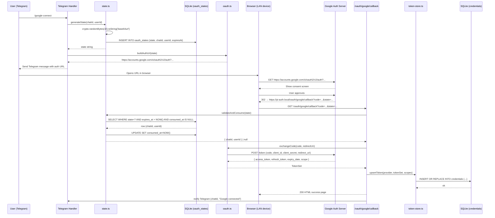

# tdmClaw — Google OAuth Technical Design Document

## Document Metadata

- Project: tdmClaw
- Document Type: Technical Design Document — Google OAuth Subsystem
- Version: 0.1
- Status: Draft
- Related Documents: `tdmClaw_TDD.md`, `tdmClaw_IP.md`, `tdmClaw_GoogleOAuth_IP.md`
- Target Runtime: Headless Ubuntu Server on Raspberry Pi
- Primary Language: TypeScript
- Primary Runtime: Node.js 22+

---

## 1. Purpose

This document defines the full technical design for the Google OAuth subsystem in tdmClaw. It covers:

- why specific OAuth credential and flow choices were made
- the complete browser-based OAuth 2.0 authorization code flow adapted for a LAN-hosted server
- state management and CSRF protection
- token storage, retrieval, and refresh
- the Gmail and Calendar API connector contracts
- security and error handling requirements
- testing strategy for all OAuth-related components

This document assumes familiarity with the main `tdmClaw_TDD.md`. It is not a general OAuth tutorial; it is a decision record and engineering specification.

---

## 2. Context and Motivation

### 2.1 Why Not Use the gogcli Pattern

The companion CLI tool `gogcli` (written in Go) handles OAuth using an **ephemeral local HTTP server** bound to `127.0.0.1:0`. The OS assigns a random available port; the redirect URI is `http://127.0.0.1:{port}/oauth2/callback`. This works because the CLI process and the browser run on the same machine, so `127.0.0.1` resolves correctly.

tdmClaw runs on a Raspberry Pi as a headless `systemd` service. The user authorizes Google from a phone or laptop on the same LAN — a different device entirely. `127.0.0.1` from the user's browser resolves to *their own machine*, not the Pi. The ephemeral server trick cannot be used.

Instead, tdmClaw hosts a **persistent LAN-accessible HTTP server** that serves the OAuth callback. The redirect URI points to the Pi's LAN hostname (e.g., `https://pi-auth.local/oauth/google/callback`).

### 2.2 OAuth Credential Type Implications

Because tdmClaw uses a stable, hosted redirect URI (not `localhost`), the Google Cloud project must use **Web Application** credentials (not Desktop/Installed credentials). Google validates that the `redirect_uri` in each authorization request exactly matches one of the registered redirect URIs for the credential.

Desktop/Installed credentials allow arbitrary `http://localhost` redirect URIs. Web Application credentials require exact matches, but support HTTPS URIs on any hostname — including LAN-only hostnames. Google's authorization server only needs to redirect the user's browser; it does not need to resolve the URI itself.

### 2.3 Why a Persistent Server Works Here

- The Pi's HTTP server (Hono, listening on a fixed port) is always running.
- A LAN-local hostname resolves to the Pi's IP address from any device on the LAN.
- TLS is terminated by a local reverse proxy (Caddy recommended) so the redirect URI is `https://`.
- Google accepts HTTPS URIs regardless of whether they are publicly reachable.
- The authorization flow completes when the user's browser follows the redirect to the Pi, which is reachable because they are on the same network.

---

## 3. Design Goals

### 3.1 Functional Goals

1. Allow a LAN device to initiate Google authorization via a Telegram command.
2. Handle the OAuth callback entirely on the Pi without requiring any public internet exposure.
3. Store and refresh Google tokens durably across process restarts.
4. Provide Gmail and Calendar API access with normalized, bounded output safe for model consumption.
5. Support one authorized Google account in v1.

### 3.2 Technical Goals

1. Cryptographically random CSRF state, stored in SQLite, expired after 10 minutes, consumed exactly once.
2. Refresh token and access token stored in the `credentials` SQLite table.
3. Automatic token refresh before API calls; no proactive background refresh.
4. Tokens redacted from all log output.
5. Google tools omitted from the tool registry when no credentials are present.

### 3.3 Non-Goals

1. Multiple concurrent Google accounts in v1.
2. Token encryption at rest in v1 (deferred to Phase 5 hardening).
3. Google Drive, Docs, Slides, or write operations in v1.
4. Calendar event creation in v1.
5. PKCE — this implementation uses plain authorization code flow with `state` for CSRF.

---

## 4. Architecture Overview

The Google OAuth subsystem spans three layers:

```
Telegram Command (/google-connect)
    │
    ▼
Telegram Handler
    │  generates state, builds auth URL, sends link to user
    ▼
SQLite oauth_states table
    │  persists state, chatId, userId, expiresAt
    ▼
User opens link in browser
    │
    ▼
Google Authorization Server
    │  redirects to https://pi-auth.local/oauth/google/callback?code=...&state=...
    ▼
Hono HTTP Server — GET /oauth/google/callback
    │  validates state (consumes row), exchanges code, stores token, notifies Telegram
    ▼
SQLite credentials table
    │  stores token JSON blob (access token + refresh token + expiry)
    ▼
Gmail / Calendar tools
    │  load token, refresh if expired, call Google APIs, normalize output
    ▼
Agent tool result
```

### 4.1 Subsystem Boundaries

| Subsystem | Responsibility |
|-----------|----------------|
| `src/google/oauth.ts` | Build auth URL, exchange code, refresh tokens, check validity |
| `src/google/state.ts` | Generate, validate, consume, expire OAuth state records |
| `src/google/token-store.ts` | Read/write/refresh token set from `credentials` table |
| `src/api/google-callback.ts` | HTTP route handler for the callback |
| `src/api/server.ts` | Hono server wiring |
| `src/google/gmail.ts` | Gmail API calls |
| `src/google/normalize-gmail.ts` | Normalize raw Gmail response to `CompactEmail` |
| `src/google/calendar.ts` | Calendar API calls |
| `src/google/normalize-calendar.ts` | Normalize raw Calendar response to `CompactCalendarEvent` |
| `src/google/scopes.ts` | Scope constants and scope-set builders |
| `src/google/types.ts` | Shared types for the Google subsystem |

---

## 5. OAuth Flow — Detailed Sequence



---

## 6. Component Design

### 6.1 Scope Definitions (`src/google/scopes.ts`)

Scopes are defined as named constants and composed into sets based on the configured feature flags.

```typescript
// src/google/scopes.ts

export const SCOPES = {
  openid: "openid",
  email: "email",
  userinfoEmail: "https://www.googleapis.com/auth/userinfo.email",
  gmailReadonly: "https://www.googleapis.com/auth/gmail.readonly",
  calendarReadonly: "https://www.googleapis.com/auth/calendar.readonly",
  // Post-v1:
  // calendarWrite: "https://www.googleapis.com/auth/calendar",
  // gmailModify: "https://www.googleapis.com/auth/gmail.modify",
} as const;

export type ScopeConfig = {
  gmailRead: boolean;
  calendarRead: boolean;
};

export function buildScopes(config: ScopeConfig): string[] {
  const scopes: string[] = [
    SCOPES.openid,
    SCOPES.email,
    SCOPES.userinfoEmail,
  ];
  if (config.gmailRead) scopes.push(SCOPES.gmailReadonly);
  if (config.calendarRead) scopes.push(SCOPES.calendarReadonly);
  return scopes;
}
```

**Design note:** OIDC scopes (`openid`, `email`, `userinfo.email`) are always included. They are cheap and allow the application to verify which account authorized the flow, which is important if multiple accounts are ever added.

---

### 6.2 Shared Types (`src/google/types.ts`)

```typescript
// src/google/types.ts

export type TokenSet = {
  accessToken: string;
  refreshToken: string;
  expiresAt: number;   // Unix timestamp ms — when the access token expires
  scopes: string[];
};

export type StoredCredential = {
  provider: "google";
  accountLabel: string | null;  // e.g. "user@gmail.com", set after first token check
  scopesJson: string;           // JSON array of granted scopes
  tokenJson: string;            // JSON-serialized TokenSet (contains refresh token)
  createdAt: string;
  updatedAt: string;
};

export type OAuthStateRecord = {
  state: string;
  provider: "google";
  telegramChatId: string;
  telegramUserId: string;
  createdAt: string;
  expiresAt: string;
  consumedAt: string | null;
};

export type CompactEmail = {
  id: string;
  threadId: string;
  from: string;
  subject: string;
  receivedAt: string;   // ISO 8601
  snippet: string;
  labels?: string[];
};

export type CompactEmailDetail = CompactEmail & {
  excerpt: string;      // Plain-text body excerpt, max 2000 chars
};

export type CompactCalendarEvent = {
  id: string;
  title: string;
  start: string;        // ISO 8601 local time
  end?: string;
  location?: string;
  descriptionExcerpt?: string;  // max 500 chars
  calendarId?: string;
};
```

---

### 6.3 OAuth State Manager (`src/google/state.ts`)

The state manager is responsible for the full lifecycle of an OAuth state token:

1. **Generate** — create cryptographically random 32-byte base64url token, write to DB with 10-minute TTL
2. **Validate** — read from DB, check expiry, check not already consumed
3. **Consume** — atomically mark as consumed (set `consumed_at`) and return associated metadata
4. **Expire** — background cleanup removes records older than 1 hour (or on startup)

```typescript
// src/google/state.ts

import * as crypto from "crypto";
import type { Database } from "better-sqlite3";
import type { OAuthStateRecord } from "./types.ts";

export const STATE_TTL_MINUTES = 10;

export type ConsumedState = {
  telegramChatId: string;
  telegramUserId: string;
};

export class OAuthStateManager {
  constructor(private readonly db: Database) {}

  generate(telegramChatId: string, telegramUserId: string): string {
    const state = crypto.randomBytes(32).toString("base64url");
    const now = new Date();
    const expiresAt = new Date(now.getTime() + STATE_TTL_MINUTES * 60 * 1000);

    this.db.prepare(`
      INSERT INTO oauth_states (state, provider, telegram_chat_id, telegram_user_id, created_at, expires_at, consumed_at)
      VALUES (?, 'google', ?, ?, ?, ?, NULL)
    `).run(
      state,
      telegramChatId,
      telegramUserId,
      now.toISOString(),
      expiresAt.toISOString(),
    );

    return state;
  }

  /**
   * Validates and atomically consumes a state token.
   * Returns null if the state is unknown, expired, or already consumed.
   */
  validateAndConsume(state: string): ConsumedState | null {
    const now = new Date().toISOString();

    // Attempt atomic consume: only updates if all conditions hold.
    const result = this.db.prepare(`
      UPDATE oauth_states
      SET consumed_at = ?
      WHERE state = ?
        AND expires_at > ?
        AND consumed_at IS NULL
    `).run(now, state, now);

    if (result.changes === 0) {
      return null;
    }

    const row = this.db.prepare(`
      SELECT telegram_chat_id, telegram_user_id
      FROM oauth_states
      WHERE state = ?
    `).get(state) as { telegram_chat_id: string; telegram_user_id: string } | undefined;

    if (!row) return null;

    return {
      telegramChatId: row.telegram_chat_id,
      telegramUserId: row.telegram_user_id,
    };
  }

  /**
   * Remove expired state records. Call on startup and periodically.
   */
  purgeExpired(): number {
    const cutoff = new Date(Date.now() - 60 * 60 * 1000).toISOString(); // 1 hour ago
    const result = this.db.prepare(`
      DELETE FROM oauth_states WHERE expires_at < ?
    `).run(cutoff);
    return result.changes;
  }
}
```

**Design notes:**
- The `UPDATE ... WHERE consumed_at IS NULL` pattern provides atomic single-use consumption. SQLite's serialized write model guarantees that only one caller wins even if two requests arrive simultaneously with the same state token.
- The state TTL is 10 minutes, matching the gogcli manual flow TTL. After 10 minutes the link is invalid and the user must run `/google-connect` again.
- `purgeExpired()` removes records older than 1 hour (not just expired), giving a window for debugging before cleanup.

---

### 6.4 OAuth Core (`src/google/oauth.ts`)

This module handles the two network-touching steps of the OAuth flow: building the authorization URL and exchanging the code for tokens. It also handles token refresh.

```typescript
// src/google/oauth.ts

import type { TokenSet } from "./types.ts";

export type OAuthConfig = {
  clientId: string;
  clientSecret: string;
  redirectUri: string;      // e.g. "https://pi-auth.local/oauth/google/callback"
  scopes: string[];
};

const TOKEN_ENDPOINT = "https://oauth2.googleapis.com/token";
const AUTH_ENDPOINT  = "https://accounts.google.com/o/oauth2/v2/auth";
const USERINFO_ENDPOINT = "https://www.googleapis.com/oauth2/v1/userinfo";

export class GoogleOAuth {
  constructor(private readonly config: OAuthConfig) {}

  /**
   * Build the Google authorization URL.
   * The state parameter is generated by OAuthStateManager and passed in.
   */
  buildAuthUrl(state: string): string {
    const params = new URLSearchParams({
      response_type: "code",
      client_id:     this.config.clientId,
      redirect_uri:  this.config.redirectUri,
      scope:         this.config.scopes.join(" "),
      state,
      access_type:   "offline",    // Required to receive a refresh_token
      prompt:        "consent",    // Forces Google to always issue a new refresh_token
      include_granted_scopes: "true",
    });
    return `${AUTH_ENDPOINT}?${params.toString()}`;
  }

  /**
   * Exchange an authorization code for a token set.
   * Throws if no refresh_token is returned (which can happen if prompt=consent
   * was not set and the user previously authorized).
   */
  async exchangeCode(code: string): Promise<TokenSet> {
    const resp = await fetch(TOKEN_ENDPOINT, {
      method: "POST",
      headers: { "Content-Type": "application/x-www-form-urlencoded" },
      body: new URLSearchParams({
        grant_type:    "authorization_code",
        code,
        redirect_uri:  this.config.redirectUri,
        client_id:     this.config.clientId,
        client_secret: this.config.clientSecret,
      }),
    });

    if (!resp.ok) {
      const body = await resp.text();
      throw new Error(`Token exchange failed: ${resp.status} ${body}`);
    }

    const data = await resp.json() as {
      access_token:  string;
      refresh_token?: string;
      expires_in:    number;
      scope:         string;
    };

    if (!data.refresh_token) {
      throw new Error(
        "Google did not return a refresh_token. " +
        "Revoke the app access in your Google account and try again."
      );
    }

    return {
      accessToken:  data.access_token,
      refreshToken: data.refresh_token,
      expiresAt:    Date.now() + data.expires_in * 1000,
      scopes:       data.scope.split(" "),
    };
  }

  /**
   * Use a refresh token to get a new access token.
   */
  async refreshAccessToken(refreshToken: string): Promise<TokenSet> {
    const resp = await fetch(TOKEN_ENDPOINT, {
      method: "POST",
      headers: { "Content-Type": "application/x-www-form-urlencoded" },
      body: new URLSearchParams({
        grant_type:    "refresh_token",
        refresh_token: refreshToken,
        client_id:     this.config.clientId,
        client_secret: this.config.clientSecret,
      }),
    });

    if (!resp.ok) {
      const body = await resp.text();
      throw new Error(`Token refresh failed: ${resp.status} ${body}`);
    }

    const data = await resp.json() as {
      access_token: string;
      expires_in:   number;
      scope:        string;
      // Note: Google does NOT return a new refresh_token on refresh —
      // the original refresh_token remains valid.
      refresh_token?: string;
    };

    return {
      accessToken:  data.access_token,
      refreshToken: data.refresh_token ?? refreshToken, // keep original if not rotated
      expiresAt:    Date.now() + data.expires_in * 1000,
      scopes:       data.scope.split(" "),
    };
  }

  /**
   * Fetch the authorized user's email address from the userinfo endpoint.
   * Used after token exchange to record the account label.
   */
  async fetchUserEmail(accessToken: string): Promise<string | null> {
    const resp = await fetch(USERINFO_ENDPOINT, {
      headers: { Authorization: `Bearer ${accessToken}` },
    });
    if (!resp.ok) return null;
    const data = await resp.json() as { email?: string };
    return data.email ?? null;
  }
}
```

**Why `prompt=consent`:** Without it, Google will not re-issue a `refresh_token` if it previously issued one for this client/user pair. On a fresh install this is not a problem, but if the user revokes and re-connects, or the token is deleted from the DB, omitting `prompt=consent` would result in a `TokenSet` with no `refresh_token`, which is caught and surfaced as an error. Always including `prompt=consent` prevents this entire class of bug.

**Why `access_type=offline`:** Required to receive a `refresh_token` at all. Without it, only an access token (short-lived, no refresh capability) is returned.

**Redirect URI must match exactly:** The same `redirectUri` string must be used in both `buildAuthUrl()` and `exchangeCode()`. Google's token endpoint validates this. If they differ even by a trailing slash, the exchange fails with `redirect_uri_mismatch`.

---

### 6.5 Token Store (`src/google/token-store.ts`)

The token store is the authoritative source of credentials for Google API clients. It:

1. Writes a token set to the `credentials` table (upsert by provider).
2. Reads the stored token set.
3. Automatically refreshes the access token if it is within 5 minutes of expiry.
4. Returns a valid `accessToken` ready for API use.

```typescript
// src/google/token-store.ts

import type { Database } from "better-sqlite3";
import type { TokenSet } from "./types.ts";
import type { GoogleOAuth } from "./oauth.ts";
import type { AppLogger } from "../app/logger.ts";

// Refresh 5 minutes before actual expiry to avoid races
const EXPIRY_BUFFER_MS = 5 * 60 * 1000;

export class GoogleTokenStore {
  constructor(
    private readonly db: Database,
    private readonly oauth: GoogleOAuth,
    private readonly logger: AppLogger,
  ) {}

  /**
   * Persist a token set. Overwrites any existing credential for "google".
   * accountLabel is optional; pass the email fetched from userinfo if available.
   */
  upsert(tokenSet: TokenSet, accountLabel: string | null = null): void {
    const now = new Date().toISOString();
    this.db.prepare(`
      INSERT INTO credentials (provider, account_label, scopes_json, token_json, created_at, updated_at)
      VALUES ('google', ?, ?, ?, ?, ?)
      ON CONFLICT (provider) DO UPDATE SET
        account_label = excluded.account_label,
        scopes_json   = excluded.scopes_json,
        token_json    = excluded.token_json,
        updated_at    = excluded.updated_at
    `).run(
      accountLabel,
      JSON.stringify(tokenSet.scopes),
      JSON.stringify(tokenSet),
      now,
      now,
    );
  }

  /**
   * Returns true if a credential record exists for Google.
   */
  hasCredential(): boolean {
    const row = this.db.prepare(`
      SELECT 1 FROM credentials WHERE provider = 'google' LIMIT 1
    `).get();
    return row !== undefined;
  }

  /**
   * Read the stored TokenSet from the DB.
   * Returns null if no credential has been stored.
   */
  private readStored(): TokenSet | null {
    const row = this.db.prepare(`
      SELECT token_json FROM credentials WHERE provider = 'google'
    `).get() as { token_json: string } | undefined;
    if (!row) return null;
    return JSON.parse(row.token_json) as TokenSet;
  }

  /**
   * Get a valid access token, refreshing if necessary.
   * Throws if no credential is stored or if refresh fails.
   */
  async getAccessToken(): Promise<string> {
    const stored = this.readStored();
    if (!stored) {
      throw new Error(
        "No Google credentials found. Use /google-connect to authorize."
      );
    }

    const needsRefresh = Date.now() >= stored.expiresAt - EXPIRY_BUFFER_MS;
    if (!needsRefresh) {
      return stored.accessToken;
    }

    this.logger.info({ subsystem: "google", event: "token_refresh_start" }, "Refreshing Google access token");

    const refreshed = await this.oauth.refreshAccessToken(stored.refreshToken);

    // Persist the refreshed token set
    this.upsert(refreshed);

    this.logger.info({ subsystem: "google", event: "token_refresh_ok" }, "Google access token refreshed");
    return refreshed.accessToken;
  }

  /**
   * Delete stored credentials. Used when the user revokes authorization.
   */
  delete(): void {
    this.db.prepare(`DELETE FROM credentials WHERE provider = 'google'`).run();
  }
}
```

**Design notes:**
- The token JSON blob (stored in `token_json`) contains both the `accessToken` and `refreshToken`. The entire blob is replaced on each refresh. This is deliberate: storing them separately would require careful handling to avoid a state where the access token was persisted but the upsert of the refresh token failed.
- The 5-minute buffer (`EXPIRY_BUFFER_MS`) prevents a race where the token is valid when read but expires before the API call completes.
- In v1, there is one credential row per provider (primary key is `provider`). Multi-account support would require changing the primary key to `(provider, account_label)`.

---

### 6.6 Callback Route Handler (`src/api/google-callback.ts`)

This is the HTTP route that Google redirects the user's browser to. It is the join point of the OAuth flow.

```typescript
// src/api/google-callback.ts

import type { Context } from "hono";
import type { OAuthStateManager } from "../google/state.ts";
import type { GoogleOAuth } from "../google/oauth.ts";
import type { GoogleTokenStore } from "../google/token-store.ts";
import type { AppLogger } from "../app/logger.ts";
import type { Bot } from "grammy";

const SUCCESS_HTML = `<!DOCTYPE html>
<html lang="en">
<head><meta charset="utf-8"><title>Connected</title></head>
<body style="font-family:sans-serif;max-width:480px;margin:4rem auto;text-align:center">
  <h1>Google account connected</h1>
  <p>You can close this tab and return to Telegram.</p>
</body>
</html>`;

const ERROR_HTML = (reason: string) => `<!DOCTYPE html>
<html lang="en">
<head><meta charset="utf-8"><title>Authorization Failed</title></head>
<body style="font-family:sans-serif;max-width:480px;margin:4rem auto;text-align:center">
  <h1>Authorization failed</h1>
  <p>${reason}</p>
  <p>Return to Telegram and try <code>/google-connect</code> again.</p>
</body>
</html>`;

export type GoogleCallbackDeps = {
  stateManager: OAuthStateManager;
  oauth:        GoogleOAuth;
  tokenStore:   GoogleTokenStore;
  bot:          Bot;
  logger:       AppLogger;
};

export function makeGoogleCallbackHandler(deps: GoogleCallbackDeps) {
  return async (c: Context) => {
    const { stateManager, oauth, tokenStore, bot, logger } = deps;

    const error = c.req.query("error");
    if (error) {
      logger.warn({ subsystem: "google", event: "oauth_denied", error }, "User denied Google authorization");
      return c.html(ERROR_HTML("Authorization was denied."), 400);
    }

    const code  = c.req.query("code");
    const state = c.req.query("state");

    if (!code || !state) {
      return c.html(ERROR_HTML("Missing required parameters."), 400);
    }

    // Validate and consume the state token (CSRF check + single-use enforcement)
    const stateData = stateManager.validateAndConsume(state);
    if (!stateData) {
      logger.warn({ subsystem: "google", event: "oauth_state_invalid", state }, "Invalid or expired OAuth state");
      return c.html(ERROR_HTML("This authorization link has expired or already been used."), 400);
    }

    let tokenSet;
    try {
      tokenSet = await oauth.exchangeCode(code);
    } catch (err) {
      logger.error({ subsystem: "google", event: "oauth_exchange_failed", err }, "Code exchange failed");
      return c.html(ERROR_HTML("Failed to exchange authorization code. Please try again."), 500);
    }

    // Best-effort: fetch the email for labeling — failure is non-fatal
    let accountLabel: string | null = null;
    try {
      accountLabel = await oauth.fetchUserEmail(tokenSet.accessToken);
    } catch {
      // Non-fatal; label will remain null
    }

    tokenStore.upsert(tokenSet, accountLabel);

    logger.info(
      { subsystem: "google", event: "oauth_complete", accountLabel: accountLabel ?? "unknown" },
      "Google OAuth complete"
    );

    // Notify the Telegram chat that initiated the flow (fire-and-forget)
    const label = accountLabel ? ` (${accountLabel})` : "";
    bot.api.sendMessage(
      stateData.telegramChatId,
      `Google account${label} connected successfully. Gmail and Calendar tools are now available.`,
    ).catch((err) => {
      logger.warn({ subsystem: "google", event: "telegram_notify_failed", err }, "Failed to send Telegram confirmation");
    });

    return c.html(SUCCESS_HTML, 200);
  };
}
```

**Error handling notes:**
- `error` query param: Google sends this if the user clicks "Deny" on the consent screen. Always check for this before looking for `code`.
- State validation failure: returns a user-friendly HTML page (not a JSON error) because the recipient is a browser, not an API client.
- Code exchange failure: the token was already consumed from the state table. This is intentional — if the code exchange fails, the user must start over with `/google-connect` (the code is single-use on Google's side regardless).
- Telegram notification is fire-and-forget: if the bot cannot send the message (e.g., the chat was deleted), the OAuth flow should still be considered successful.

---

### 6.7 Hono Server Wiring (`src/api/server.ts`)

```typescript
// src/api/server.ts

import { Hono } from "hono";
import { serve } from "@hono/node-server";
import type { GoogleCallbackDeps } from "./google-callback.ts";
import { makeGoogleCallbackHandler } from "./google-callback.ts";
import type { AppLogger } from "../app/logger.ts";

export type ApiServerConfig = {
  host: string;   // e.g. "0.0.0.0" or "127.0.0.1"
  port: number;
};

export function createApiServer(
  config: ApiServerConfig,
  google: GoogleCallbackDeps,
  logger: AppLogger,
): { start: () => void; stop: () => Promise<void> } {
  const app = new Hono();

  app.get("/healthz", (c) => c.json({ ok: true }));

  app.get("/oauth/google/callback", makeGoogleCallbackHandler(google));

  // Catch-all — return 404 for anything else
  app.all("*", (c) => c.text("Not found", 404));

  let server: ReturnType<typeof serve> | null = null;

  return {
    start() {
      server = serve({ fetch: app.fetch, hostname: config.host, port: config.port }, (info) => {
        logger.info({ subsystem: "api", event: "server_start", port: info.port }, "API server listening");
      });
    },
    async stop() {
      if (server) {
        await new Promise<void>((resolve) => server!.close(() => resolve()));
      }
    },
  };
}
```

---

### 6.8 Telegram `/google-connect` Handler

This section of the Telegram handler generates the OAuth state and sends the authorization URL.

```typescript
// Relevant portion of src/telegram/handler.ts

import type { OAuthStateManager } from "../google/state.ts";
import type { GoogleOAuth } from "../google/oauth.ts";

// Called when the bot receives /google-connect
async function handleGoogleConnect(
  chatId: string,
  userId: string,
  stateManager: OAuthStateManager,
  oauth: GoogleOAuth,
  sendMessage: (chatId: string, text: string) => Promise<void>,
): Promise<void> {
  const state   = stateManager.generate(chatId, userId);
  const authUrl = oauth.buildAuthUrl(state);

  await sendMessage(
    chatId,
    `To connect your Google account, open this link on any device on your local network:\n\n${authUrl}\n\nThis link expires in 10 minutes.`,
  );
}
```

---

### 6.9 Gmail API Client (`src/google/gmail.ts`)

```typescript
// src/google/gmail.ts

import type { GoogleTokenStore } from "./token-store.ts";
import type { CompactEmail, CompactEmailDetail } from "./types.ts";
import { normalizeGmailMessage, normalizeGmailMessageDetail } from "./normalize-gmail.ts";

const GMAIL_BASE = "https://gmail.googleapis.com/gmail/v1/users/me";

export class GmailClient {
  constructor(private readonly tokenStore: GoogleTokenStore) {}

  private async headers(): Promise<HeadersInit> {
    const token = await this.tokenStore.getAccessToken();
    return { Authorization: `Bearer ${token}` };
  }

  async listRecent(params: {
    newerThanHours: number;
    maxResults: number;
    labelIds?: string[];
    query?: string;
  }): Promise<CompactEmail[]> {
    const q = buildGmailQuery(params);
    const url = new URL(`${GMAIL_BASE}/messages`);
    url.searchParams.set("maxResults", String(Math.min(params.maxResults, 50)));
    url.searchParams.set("q", q);
    if (params.labelIds?.length) {
      params.labelIds.forEach((l) => url.searchParams.append("labelIds", l));
    }

    const resp = await fetch(url, { headers: await this.headers() });
    if (!resp.ok) throw new Error(`Gmail list failed: ${resp.status}`);

    const data = await resp.json() as { messages?: Array<{ id: string; threadId: string }> };
    const messages = data.messages ?? [];

    // Fetch each message header in parallel (bounded)
    const details = await Promise.all(
      messages.slice(0, params.maxResults).map((m) => this.fetchMessageHeaders(m.id)),
    );

    return details.filter((d): d is CompactEmail => d !== null);
  }

  private async fetchMessageHeaders(id: string): Promise<CompactEmail | null> {
    const url = `${GMAIL_BASE}/messages/${id}?format=metadata&metadataHeaders=From&metadataHeaders=Subject&metadataHeaders=Date`;
    const resp = await fetch(url, { headers: await this.headers() });
    if (!resp.ok) return null;
    const raw = await resp.json();
    return normalizeGmailMessage(raw);
  }

  async getMessage(params: { id: string }): Promise<CompactEmailDetail | null> {
    const url = `${GMAIL_BASE}/messages/${params.id}?format=full`;
    const resp = await fetch(url, { headers: await this.headers() });
    if (!resp.ok) return null;
    const raw = await resp.json();
    return normalizeGmailMessageDetail(raw);
  }
}

function buildGmailQuery(params: { newerThanHours: number; query?: string }): string {
  const parts: string[] = [`newer_than:${params.newerThanHours}h`];
  if (params.query) parts.push(params.query);
  return parts.join(" ");
}
```

---

### 6.10 Gmail Normalizer (`src/google/normalize-gmail.ts`)

Raw Gmail API responses contain MIME trees, base64-encoded bodies, and dozens of headers. This normalizer extracts only what the model needs.

```typescript
// src/google/normalize-gmail.ts

import type { CompactEmail, CompactEmailDetail } from "./types.ts";

const EXCERPT_MAX = 2000;
const SNIPPET_MAX = 300;

export function normalizeGmailMessage(raw: any): CompactEmail | null {
  try {
    const headers: Array<{ name: string; value: string }> = raw.payload?.headers ?? [];
    const get = (name: string) =>
      headers.find((h) => h.name.toLowerCase() === name.toLowerCase())?.value ?? "";

    return {
      id:         raw.id,
      threadId:   raw.threadId,
      from:       get("From"),
      subject:    get("Subject"),
      receivedAt: internalDateToIso(raw.internalDate),
      snippet:    (raw.snippet ?? "").slice(0, SNIPPET_MAX),
      labels:     raw.labelIds ?? [],
    };
  } catch {
    return null;
  }
}

export function normalizeGmailMessageDetail(raw: any): CompactEmailDetail | null {
  const base = normalizeGmailMessage(raw);
  if (!base) return null;

  const excerpt = extractTextBody(raw.payload) ?? "";
  return {
    ...base,
    excerpt: excerpt.slice(0, EXCERPT_MAX),
  };
}

function internalDateToIso(internalDate: string | undefined): string {
  if (!internalDate) return new Date().toISOString();
  return new Date(parseInt(internalDate, 10)).toISOString();
}

/**
 * Recursively find the first text/plain part in the MIME tree.
 * Falls back to text/html stripped of tags if no plain text found.
 */
function extractTextBody(payload: any): string | null {
  if (!payload) return null;

  const mimeType: string = payload.mimeType ?? "";

  if (mimeType === "text/plain" && payload.body?.data) {
    return decodeBase64Url(payload.body.data);
  }

  if (payload.parts) {
    // Prefer text/plain
    for (const part of payload.parts) {
      if (part.mimeType === "text/plain") {
        const text = extractTextBody(part);
        if (text) return text;
      }
    }
    // Fall back to any part
    for (const part of payload.parts) {
      const text = extractTextBody(part);
      if (text) return text;
    }
  }

  if (mimeType === "text/html" && payload.body?.data) {
    return stripHtmlTags(decodeBase64Url(payload.body.data));
  }

  return null;
}

function decodeBase64Url(encoded: string): string {
  const base64 = encoded.replace(/-/g, "+").replace(/_/g, "/");
  return Buffer.from(base64, "base64").toString("utf-8");
}

function stripHtmlTags(html: string): string {
  return html
    .replace(/<style[\s\S]*?<\/style>/gi, "")
    .replace(/<script[\s\S]*?<\/script>/gi, "")
    .replace(/<[^>]+>/g, " ")
    .replace(/\s{2,}/g, " ")
    .trim();
}
```

---

### 6.11 Calendar API Client (`src/google/calendar.ts`)

```typescript
// src/google/calendar.ts

import type { GoogleTokenStore } from "./token-store.ts";
import type { CompactCalendarEvent } from "./types.ts";
import { normalizeCalendarEvent } from "./normalize-calendar.ts";

const CALENDAR_BASE = "https://www.googleapis.com/calendar/v3";

export class CalendarClient {
  constructor(private readonly tokenStore: GoogleTokenStore) {}

  private async headers(): Promise<HeadersInit> {
    const token = await this.tokenStore.getAccessToken();
    return { Authorization: `Bearer ${token}` };
  }

  async listWindow(params: {
    startIso: string;
    endIso: string;
    calendarIds?: string[];
    maxResults?: number;
  }): Promise<CompactCalendarEvent[]> {
    const calendarIds = params.calendarIds ?? ["primary"];
    const maxResults  = Math.min(params.maxResults ?? 20, 50);

    // Fetch from each calendar in parallel
    const perCalendar = await Promise.all(
      calendarIds.map((calId) =>
        this.listCalendarWindow(calId, params.startIso, params.endIso, maxResults),
      ),
    );

    // Merge, sort by start time, cap total
    return perCalendar
      .flat()
      .sort((a, b) => a.start.localeCompare(b.start))
      .slice(0, maxResults);
  }

  private async listCalendarWindow(
    calendarId: string,
    timeMin: string,
    timeMax: string,
    maxResults: number,
  ): Promise<CompactCalendarEvent[]> {
    const url = new URL(`${CALENDAR_BASE}/calendars/${encodeURIComponent(calendarId)}/events`);
    url.searchParams.set("timeMin", timeMin);
    url.searchParams.set("timeMax", timeMax);
    url.searchParams.set("maxResults", String(maxResults));
    url.searchParams.set("singleEvents", "true");
    url.searchParams.set("orderBy", "startTime");

    const resp = await fetch(url, { headers: await this.headers() });
    if (!resp.ok) {
      // Non-fatal: return empty list for this calendar
      return [];
    }

    const data = await resp.json() as { items?: any[] };
    return (data.items ?? [])
      .map((item: any) => normalizeCalendarEvent(item, calendarId))
      .filter((e): e is CompactCalendarEvent => e !== null);
  }
}
```

---

### 6.12 Calendar Normalizer (`src/google/normalize-calendar.ts`)

```typescript
// src/google/normalize-calendar.ts

import type { CompactCalendarEvent } from "./types.ts";

const DESCRIPTION_MAX = 500;

export function normalizeCalendarEvent(raw: any, calendarId?: string): CompactCalendarEvent | null {
  try {
    return {
      id:    raw.id,
      title: raw.summary ?? "(No title)",
      start: normalizeDateTime(raw.start),
      end:   raw.end ? normalizeDateTime(raw.end) : undefined,
      location:            raw.location?.slice(0, 200) ?? undefined,
      descriptionExcerpt:  raw.description
        ? stripHtml(raw.description).slice(0, DESCRIPTION_MAX)
        : undefined,
      calendarId,
    };
  } catch {
    return null;
  }
}

/**
 * Google Calendar events can have either dateTime (timed) or date (all-day).
 */
function normalizeDateTime(dt: { dateTime?: string; date?: string }): string {
  return dt.dateTime ?? dt.date ?? "";
}

function stripHtml(html: string): string {
  return html.replace(/<[^>]+>/g, " ").replace(/\s{2,}/g, " ").trim();
}
```

---

### 6.13 Tool Implementations

#### `gmail_list_recent` (`src/tools/gmail-list-recent.ts`)

```typescript
import type { ToolHandler, ToolContext } from "../agent/types.ts";
import type { GmailClient } from "../google/gmail.ts";
import { z } from "zod";

const ArgsSchema = z.object({
  newerThanHours: z.number().int().min(1).max(168).default(24)
    .describe("How many hours back to search (max 168 = 1 week)"),
  maxResults: z.number().int().min(1).max(20).default(10)
    .describe("Maximum number of emails to return"),
  query: z.string().optional()
    .describe("Optional Gmail search query (e.g. 'is:unread', 'from:someone@example.com')"),
});

type Args = z.infer<typeof ArgsSchema>;

export function makeGmailListRecentTool(gmail: GmailClient): ToolHandler<Args, string> {
  return {
    name: "gmail_list_recent",
    description:
      "List recent emails. Returns sender, subject, timestamp, and snippet. " +
      "Use gmail_get_message to read the full body of a specific email.",
    schema: ArgsSchema,
    async execute(args, ctx: ToolContext) {
      const emails = await gmail.listRecent({
        newerThanHours: args.newerThanHours,
        maxResults:     args.maxResults,
        query:          args.query,
      });
      if (emails.length === 0) return "No emails found matching the criteria.";
      return emails
        .map(
          (e) =>
            `[${e.id}] ${e.receivedAt} | From: ${e.from} | Subject: ${e.subject}\n  ${e.snippet}`,
        )
        .join("\n\n");
    },
  };
}
```

#### `gmail_get_message` (`src/tools/gmail-get-message.ts`)

```typescript
import type { ToolHandler, ToolContext } from "../agent/types.ts";
import type { GmailClient } from "../google/gmail.ts";
import { z } from "zod";

const ArgsSchema = z.object({
  id: z.string().describe("The Gmail message ID from gmail_list_recent"),
});

type Args = z.infer<typeof ArgsSchema>;

export function makeGmailGetMessageTool(gmail: GmailClient): ToolHandler<Args, string> {
  return {
    name: "gmail_get_message",
    description: "Fetch the full body of a specific email by its ID.",
    schema: ArgsSchema,
    async execute(args, _ctx: ToolContext) {
      const msg = await gmail.getMessage({ id: args.id });
      if (!msg) return `Email ${args.id} not found.`;
      return [
        `From: ${msg.from}`,
        `Subject: ${msg.subject}`,
        `Date: ${msg.receivedAt}`,
        ``,
        msg.excerpt || "(No readable body)",
      ].join("\n");
    },
  };
}
```

#### `calendar_list_today` / `calendar_list_tomorrow`

```typescript
// src/tools/calendar-list-today.ts

import type { ToolHandler, ToolContext } from "../agent/types.ts";
import type { CalendarClient } from "../google/calendar.ts";
import { z } from "zod";

const ArgsSchema = z.object({
  calendarIds: z.array(z.string()).optional()
    .describe("Calendar IDs to query. Defaults to ['primary']."),
});

type Args = z.infer<typeof ArgsSchema>;

function todayWindow(timezone: string): { startIso: string; endIso: string } {
  const now = new Date();
  // Compute local midnight in the configured timezone
  const fmt = (d: Date) => d.toISOString();
  const startOfDay = new Date(now.toLocaleDateString("en-CA", { timeZone: timezone }) + "T00:00:00");
  const endOfDay   = new Date(now.toLocaleDateString("en-CA", { timeZone: timezone }) + "T23:59:59");
  return { startIso: fmt(startOfDay), endIso: fmt(endOfDay) };
}

export function makeCalendarListTodayTool(
  calendar: CalendarClient,
  timezone: string,
): ToolHandler<Args, string> {
  return {
    name: "calendar_list_today",
    description: "List calendar events for today.",
    schema: ArgsSchema,
    async execute(args, _ctx: ToolContext) {
      const window = todayWindow(timezone);
      const events = await calendar.listWindow({
        ...window,
        calendarIds: args.calendarIds,
        maxResults: 20,
      });
      if (events.length === 0) return "No events today.";
      return events
        .map((e) => `${e.start}${e.end ? ` – ${e.end}` : ""} | ${e.title}${e.location ? ` @ ${e.location}` : ""}`)
        .join("\n");
    },
  };
}
```

The `calendar_list_tomorrow` tool is identical except the window is computed for the next calendar day.

---

### 6.14 Token Redaction (`src/security/redact.ts`)

Any log line that could contain an access token, refresh token, or full callback URL must be sanitized before writing.

```typescript
// src/security/redact.ts

const TOKEN_PATTERN = /ya29\.[A-Za-z0-9_\-]+/g;
const REFRESH_PATTERN = /1\/\/[A-Za-z0-9_\-]+/g;
const BEARER_PATTERN = /Bearer\s+[A-Za-z0-9_\-\.]+/gi;

export function redact(value: string): string {
  return value
    .replace(TOKEN_PATTERN, "[ACCESS_TOKEN]")
    .replace(REFRESH_PATTERN, "[REFRESH_TOKEN]")
    .replace(BEARER_PATTERN, "Bearer [REDACTED]");
}

/**
 * Redact sensitive keys from an object before logging.
 * Use this when logging the full query string from the OAuth callback.
 */
export function redactQueryParams(url: string): string {
  try {
    const u = new URL(url);
    for (const key of ["code", "access_token", "refresh_token", "token"]) {
      if (u.searchParams.has(key)) {
        u.searchParams.set(key, "[REDACTED]");
      }
    }
    return u.toString();
  } catch {
    return "[invalid url]";
  }
}
```

---

## 7. Database Schema

The OAuth subsystem uses two tables from the main schema.

### `oauth_states`

```sql
CREATE TABLE IF NOT EXISTS oauth_states (
  state            TEXT PRIMARY KEY,
  provider         TEXT NOT NULL,
  telegram_chat_id TEXT NOT NULL,
  telegram_user_id TEXT NOT NULL,
  created_at       TEXT NOT NULL,
  expires_at       TEXT NOT NULL,
  consumed_at      TEXT
);
```

An index on `expires_at` speeds up the `purgeExpired()` query:

```sql
CREATE INDEX IF NOT EXISTS idx_oauth_states_expires_at ON oauth_states (expires_at);
```

### `credentials`

```sql
CREATE TABLE IF NOT EXISTS credentials (
  provider      TEXT PRIMARY KEY,
  account_label TEXT,
  scopes_json   TEXT NOT NULL,
  token_json    TEXT NOT NULL,
  created_at    TEXT NOT NULL,
  updated_at    TEXT NOT NULL
);
```

The `token_json` column stores a JSON-serialized `TokenSet` which contains both `accessToken` and `refreshToken`. In v1, there is at most one row per provider.

---

## 8. Security Design

### 8.1 CSRF Protection

The `state` parameter is 32 bytes of cryptographically random data encoded as base64url. It is generated per authorization attempt and stored in the `oauth_states` table. It is validated and atomically consumed on callback. An attacker who does not know the state value cannot complete the callback even if they can send a request to the callback URL.

### 8.2 Single-Use State Tokens

The `validateAndConsume()` method uses an atomic `UPDATE ... WHERE consumed_at IS NULL` to ensure a state token can only be used once. SQLite's serialized write model guarantees this even under concurrent requests.

### 8.3 Token Storage

In v1, the `TokenSet` JSON (including `refreshToken`) is stored in plain text in the SQLite `credentials` table. The database file should have restricted permissions (`chmod 600`). Encryption at rest is deferred to Phase 5 hardening.

The refresh token must never appear in logs. The `redact.ts` utilities should be applied to any log fields that could transitively include token values.

### 8.4 Redirect URI Registration

The redirect URI (`https://pi-auth.local/oauth/google/callback`) must be registered exactly in the Google Cloud Console under Authorized Redirect URIs for the Web Application credential. Google rejects any `redirect_uri` in the token exchange request that does not match a registered URI.

### 8.5 State Expiry

States expire after 10 minutes. The `purgeExpired()` method removes records older than 1 hour and should be called on startup and periodically (hourly is sufficient).

### 8.6 Credential Type Note

Web Application credentials are used (not Desktop/Installed). This is the correct type for a server-side OAuth flow with a stable redirect URI. Desktop/Installed credentials would also technically work if the redirect URI were changed to `http://localhost`, but that would introduce unnecessary confusion about the credential type's intended use.

---

## 9. Error Handling

| Error | Detection | Handling |
|-------|-----------|----------|
| User denies consent | `?error=access_denied` in callback | HTML error page, log warning, no Telegram notification |
| State not found / expired | `validateAndConsume` returns null | HTML error page (user-friendly), no crash |
| State already consumed | Same as above — atomic UPDATE changes=0 | HTML error page |
| Code exchange fails | Non-2xx from Google token endpoint | HTML 500 error page, log error with status |
| No refresh_token in response | Check after exchange | Throw, caught by callback handler, HTML 500 page |
| Token refresh fails | Non-2xx from Google token endpoint | Throw up the call stack; tool returns structured error to model |
| Gmail API non-2xx | HTTP error | Throw; tool returns error string to model |
| Calendar API non-2xx | HTTP error | Return empty list from that calendar; do not crash |
| Telegram notification fails | grammy throws | Log warning, do not fail the overall callback flow |

---

## 10. Testing Strategy

### 10.1 Unit Tests

| Module | What to Test |
|--------|-------------|
| `state.ts` | `generate()` produces 43-char base64url strings; `validateAndConsume()` returns null for expired/consumed states; concurrent consume calls — only one wins |
| `oauth.ts` | `buildAuthUrl()` includes all required parameters; `exchangeCode()` parses response correctly; throws on missing `refresh_token` |
| `normalize-gmail.ts` | Extracts plain text from MIME tree; falls back to HTML with tag stripping; handles missing headers gracefully |
| `normalize-calendar.ts` | Handles `date` vs `dateTime` events; caps description length |
| `token-store.ts` | `getAccessToken()` triggers refresh when within buffer; persists refreshed token; throws when no credentials stored |
| `redact.ts` | Redacts access tokens, refresh tokens, bearer headers, code params from URLs |

### 10.2 Integration Tests

| Flow | Approach |
|------|---------|
| Full OAuth callback | Mock `fetch` for token exchange endpoint; call route handler directly; assert state consumed and token stored |
| Token refresh | Pre-populate DB with expired token; call `getAccessToken()`; assert refresh called and new token stored |
| Gmail list | Mock `fetch` for Gmail API; assert normalizer applied; assert bounded result count |
| Calendar list | Mock `fetch` for Calendar API; assert multi-calendar merge and sort |
| Expired state rejection | Insert expired state; call callback handler; assert HTML contains error message |

### 10.3 What Cannot Be Unit-Tested Without Real Credentials

- Actual Google consent screen flow
- Real token exchange
- Real API responses from Gmail and Calendar

These require live smoke tests with real credentials and are performed manually or via a dedicated integration test environment with a test Google account.

---

## 11. LAN Deployment Requirements

### 11.1 Required Infrastructure

- Pi accessible on LAN at a stable hostname (e.g., `pi-auth.local` or a local DNS entry)
- HTTPS termination: Caddy reverse proxy on the Pi, using a LAN-only certificate (Let's Encrypt with DNS-01 challenge, or a self-signed cert trusted on LAN devices)
- Node app listens on `127.0.0.1:{callbackPort}` (not exposed to LAN directly)
- Caddy proxies `https://pi-auth.local/oauth/*` → `http://127.0.0.1:{callbackPort}/oauth/*`

### 11.2 Google Cloud Console Configuration

1. Create a project (or reuse existing).
2. Enable the Gmail API and Google Calendar API.
3. Create OAuth 2.0 credentials of type **Web Application**.
4. Add `https://pi-auth.local/oauth/google/callback` (or your chosen hostname) to **Authorized redirect URIs**.
5. Download the `client_id` and `client_secret` and add them to the tdmClaw config.

### 11.3 Why HTTPS Is Required

Google's authorization server will not redirect to `http://` URIs on non-localhost hostnames (it rejects them as insecure). Since the Pi's hostname is not `localhost` from the perspective of the user's browser (it is a LAN hostname), HTTPS is required for the redirect URI.

The one exception: during local development, `http://localhost:PORT/oauth/google/callback` works and can be registered as a Web Application redirect URI.

---

## 12. Open Questions

1. Should the `credentials` table use per-account primary keys in anticipation of multi-account support, or is `provider TEXT PRIMARY KEY` acceptable for v1?
2. Should `purgeExpired()` run on a timer inside the main process, or only on startup?
3. When the user runs `/google-connect` while credentials already exist, should the flow warn the user and overwrite, or require an explicit `/google-disconnect` first?
4. Should the success/error HTML pages be inline (as in this design) or served from template files?
