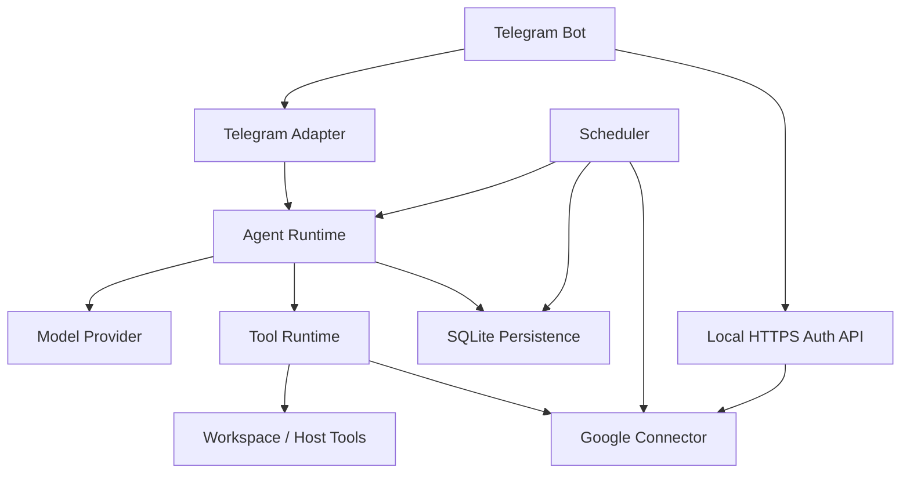
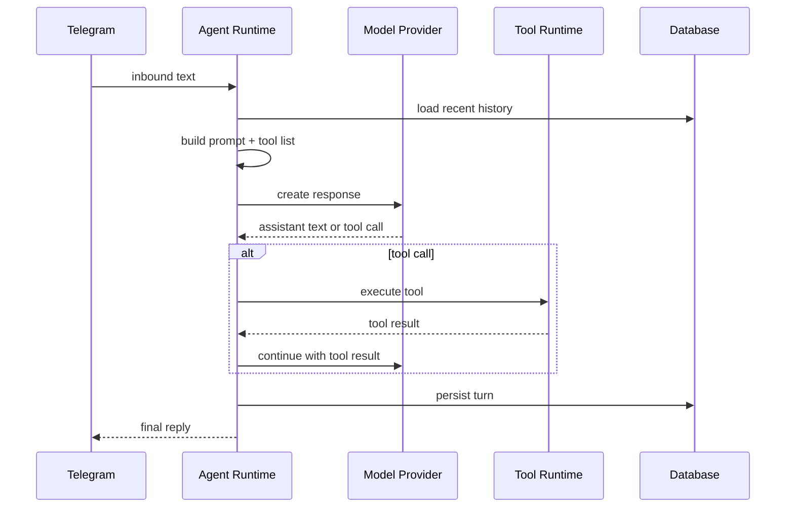

# tdmClaw Technical Design Document

## Document Metadata

- Project: tdmClaw
- Document Type: Technical Design Document
- Version: 0.1
- Status: Draft
- Related Document: `tdmClaw_PRD.md`
- Target Runtime: Headless Ubuntu Server on Raspberry Pi
- Primary Language: TypeScript
- Primary Runtime: Node.js 22+

## 1. Purpose

This document translates the product requirements in `tdmClaw_PRD.md` into an implementation-oriented technical design. It defines the target architecture, subsystem boundaries, runtime flows, data model, interface contracts, operational model, and phased implementation details required to build tdmClaw as a Raspberry Pi-hosted Telegram assistant with Gmail, Google Calendar, local tools, and built-in scheduling.

The system is intentionally designed to be much smaller than OpenClaw. This document prioritizes:

- explicit module boundaries
- low prompt overhead
- narrow tool interfaces
- deterministic preprocessing of external data
- operational simplicity

## 2. Design Goals

## 2.1 Primary Technical Goals

1. Run continuously as a `systemd` service on a Raspberry Pi.
2. Provide a Telegram-first conversational interface.
3. Support a bounded tool-using agent loop.
4. Integrate Gmail and Google Calendar through first-party internal connectors.
5. Provide durable scheduled jobs and daily briefing workflows.
6. Keep the implementation small, explicit, and maintainable.

## 2.2 Technical Non-Goals

1. Dynamic plugin loading.
2. Multi-channel abstractions.
3. Generic automation engine in v1.
4. Complex vector memory or retrieval.
5. Browser automation or desktop-style UI logic.
6. Tight compatibility with OpenClaw internals or skills.

## 3. Architecture Summary

tdmClaw will be implemented as a single Node.js process composed of the following major subsystems:

1. App Core
2. Telegram Adapter
3. Agent Runtime
4. Tool Runtime
5. Google Connector
6. Scheduler
7. Persistence Layer
8. Auth Callback API

High-level flow:

1. Telegram message arrives.
2. Telegram adapter normalizes it to an internal request.
3. Session state is loaded.
4. Agent runtime constructs a compact prompt and tool list.
5. LLM backend is called.
6. If the model requests tools, the tool runtime executes them and loops.
7. Final answer is returned to Telegram.
8. Scheduler independently triggers jobs that reuse selected Google and summarization flows.

## 4. Top-Level System Diagram



## 5. Process Model

## 5.1 Single Main Process

The default deployment uses one Node.js process that hosts:

- Telegram polling loop
- local HTTP server for OAuth callback
- agent runtime
- scheduler tick loop
- SQLite access

This is preferred for v1 because it reduces coordination complexity and operational burden.

## 5.2 Optional Companion Services

The main process may depend on one or more external local services:

- local model server such as Ollama or another OpenAI-compatible endpoint
- reverse proxy or TLS terminator such as Caddy for LAN-only HTTPS

These are infrastructure dependencies, not code-level subsystems of tdmClaw.

## 6. Proposed Repository Layout

```text
tdmclaw/
  src/
    index.ts
    app/
      bootstrap.ts
      config.ts
      env.ts
      logger.ts
      shutdown.ts
    telegram/
      bot.ts
      polling.ts
      routing.ts
      format.ts
      handler.ts
      guards.ts
      types.ts
    agent/
      runtime.ts
      prompt.ts
      history.ts
      loop.ts
      session.ts
      response.ts
      tool-registry.ts
      types.ts
      providers/
        openai-compatible.ts
        local.ts
        types.ts
        discovery.ts
    tools/
      common.ts
      list-files.ts
      read-file.ts
      write-file.ts
      apply-patch.ts
      exec.ts
      gmail-list-recent.ts
      gmail-get-message.ts
      calendar-list-today.ts
      calendar-list-tomorrow.ts
    google/
      oauth.ts
      token-store.ts
      gmail.ts
      calendar.ts
      normalize-gmail.ts
      normalize-calendar.ts
      scopes.ts
      state.ts
      types.ts
    scheduler/
      service.ts
      runner.ts
      timing.ts
      locks.ts
      types.ts
      jobs/
        daily-briefing.ts
        email-digest.ts
        calendar-briefing.ts
    services/
      briefing.ts
      summarization.ts
    storage/
      db.ts
      migrations.ts
      sessions.ts
      messages.ts
      jobs.ts
      job-runs.ts
      credentials.ts
      settings.ts
      model-selection.ts
    api/
      server.ts
      google-callback.ts
      health.ts
    security/
      redact.ts
      paths.ts
      exec-policy.ts
      crypto.ts
  systemd/
    tdmclaw.service
  docs/
  tdmClaw_PRD.md
  tdmClaw_TDD.md
```

## 7. Configuration Model

## 7.1 Configuration Sources

Configuration precedence:

1. environment variables
2. local config file
3. built-in defaults

The config file should be YAML or JSON. YAML is preferred for readability.

## 7.2 Config Shape

```ts
export type AppConfig = {
  app: {
    dataDir: string;
    logLevel: "debug" | "info" | "warn" | "error";
    timezone: string;
  };
  telegram: {
    botToken: string;
    allowedUserIds: string[];
    allowedChatIds?: string[];
    polling: {
      enabled: boolean;
      timeoutSeconds: number;
    };
  };
  workspace: {
    root: string;
    writableRoots?: string[];
  };
  models: {
    provider: "openai-compatible";
    baseUrl: string;
    apiKey?: string;
    model?: string;
    fallbackModels?: string[];
    maxToolIterations: number;
    maxHistoryTurns: number;
    maxPromptTokensHint?: number;
    discovery: {
      enabled: boolean;
      pollIntervalSeconds: number;
    };
  };
  tools: {
    exec: {
      enabled: boolean;
      timeoutSeconds: number;
      maxOutputChars: number;
      approvalMode: "off" | "owner-only";
      blockedCommands?: string[];
      blockedPatterns?: string[];
    };
    applyPatch: {
      enabled: boolean;
    };
  };
  google: {
    enabled: boolean;
    scopes: {
      gmailRead: boolean;
      calendarRead: boolean;
      calendarWrite?: boolean;
    };
  };
  scheduler: {
    enabled: boolean;
    pollIntervalSeconds: number;
    catchUpWindowMinutes: number;
  };
};
```

## 7.3 Required Initial Settings

Minimum configuration for v1:

- Telegram bot token
- allowed Telegram user id
- workspace root
- model provider URL and model id
- scheduler timezone

Google OAuth client credentials are uploaded at runtime via the `/google-setup` Telegram command and stored in the `google_client` SQLite table — not in config.

## 8. Subsystem Design

## 8.1 App Core

### Responsibilities

- load configuration
- initialize SQLite
- initialize logger
- initialize Telegram bot
- initialize local HTTP callback server
- initialize scheduler
- wire dependencies
- handle shutdown

### Key module

- `src/app/bootstrap.ts`

### Startup sequence

1. load environment and config
2. create logger
3. ensure data directories exist
4. open SQLite and run migrations
5. create Google token store
6. create model provider client
7. create tool registry
8. create agent runtime
9. create Telegram adapter
10. create scheduler
11. start local HTTP server (healthz only)
12. start Telegram polling
13. start scheduler loop

## 8.2 Telegram Adapter

### Responsibilities

- receive inbound messages
- validate sender/chat
- route to session
- invoke agent runtime
- send reply

### Design constraints

- polling first
- webhooks out of scope for v1
- minimal formatting layer
- no complicated per-channel abstractions

### Key modules

- `src/telegram/polling.ts`
- `src/telegram/handler.ts`
- `src/telegram/routing.ts`

### Internal request type

```ts
export type TelegramInboundRequest = {
  messageId: number;
  chatId: string;
  userId: string;
  username?: string;
  text: string;
  receivedAt: string;
  replyToMessageId?: number;
};
```

### Session routing strategy

Session key format:

```text
telegram:<chatId>
```

This keeps session semantics simple for v1.

Optional future refinement:

- `telegram:<chatId>:thread:<threadId>`

Not required initially.

## 8.3 Agent Runtime

### Responsibilities

- build prompt
- load history
- resolve available tools
- call model provider
- execute tool loop
- persist messages
- return final assistant output

### Key modules

- `src/agent/runtime.ts`
- `src/agent/loop.ts`
- `src/agent/prompt.ts`
- `src/agent/history.ts`

### Design principles

- small prompt
- bounded history
- bounded tools
- deterministic tool results
- small loop count

### Agent turn pipeline



### Internal turn type

```ts
export type AgentTurnInput = {
  sessionId: string;
  userMessage: string;
  sender: {
    telegramUserId: string;
    chatId: string;
    username?: string;
  };
};
```

### Internal message type

```ts
export type StoredMessage = {
  id: string;
  sessionId: string;
  role: "system" | "user" | "assistant" | "tool";
  content: string;
  toolName?: string;
  createdAt: string;
};
```

## 8.4 Prompt Composition

### Goals

- minimize token cost
- avoid dynamic product-wide bloat
- include only the context needed for the current turn

### Prompt sections

1. identity
2. concise operating constraints
3. workspace policy
4. tool summaries
5. optional turn-specific instructions

### Example prompt structure

```text
You are tdmClaw, a self-hosted assistant running on a Raspberry Pi.

Rules:
- Keep responses concise.
- Use tools when needed.
- Do not access files outside the workspace.
- Prefer small reads over large reads.
- If command output is large, summarize it.

Workspace:
- Root: /opt/tdmclaw/workspace

Available tools:
- list_files(path, depth?)
- read_file(path, startLine?, maxLines?)
- write_file(path, content)
- apply_patch(input)
- exec(command, workdir?, timeoutSeconds?)
```

### Prompt exclusion rules

The prompt must not automatically include:

- repo-wide docs
- bootstrap files
- skills list
- memory policy text
- historical summaries unless explicitly needed

### History policy

Default: last 6 messages, or last 3 user-assistant pairs, whichever is simpler.

Later enhancement:

- compress older history into one short summary field

## 8.5 Model Provider Layer

### Scope

v1 supports only one provider family:

- OpenAI-compatible chat or responses API

This allows:

- local providers such as Ollama or OpenAI-compatible inference servers
- remote providers if needed

### Model Discovery

When the provider is Ollama (or any OpenAI-compatible endpoint that exposes `GET /api/tags`), the application must:

1. On startup, call `GET /api/tags` to fetch the list of locally available models.
2. Store the result in memory as the **available model list**.
3. If `models.model` is set in config and present in the available list, use it.
4. If `models.model` is unset or absent from the list, select the first available model and log a warning.
5. Periodically re-poll the available model list at `models.discovery.pollIntervalSeconds` to detect newly pulled or removed models.
6. If the active model is removed, attempt the first model in `models.fallbackModels` that is still available, then the first available model, then surface an error to Telegram.

The user can inspect and change the active model at runtime via Telegram commands (see §8.5.1).

### Discovery interface

```ts
export type ModelDiscovery = {
  listAvailable(): Promise<DiscoveredModel[]>;
  getActive(): DiscoveredModel | null;
  setActive(modelName: string): Promise<void>;
  getFallbackChain(): DiscoveredModel[];
};

export type DiscoveredModel = {
  name: string;
  size?: number;
  modifiedAt?: string;
  digest?: string;
};
```

Discovery state is held in memory. The currently-selected model name is persisted in the `settings` table so it survives restarts.

### §8.5.1 Telegram Model Management Commands

| Command | Behavior |
|---------|----------|
| `/models` | Lists all models currently available on the Ollama endpoint |
| `/model` | Shows the currently active model and fallback chain |
| `/setmodel <name>` | Sets the active model to `<name>` (must be in available list) |
| `/setfallback <name> [name...]` | Sets the ordered fallback model list |

### Provider interface

```ts
export type ModelProvider = {
  generate(input: ModelGenerateInput): Promise<ModelGenerateOutput>;
};

export type ModelGenerateInput = {
  systemPrompt: string;
  messages: Array<{
    role: "user" | "assistant" | "tool";
    content: string;
    toolCallId?: string;
    toolName?: string;
  }>;
  tools: ToolDefinition[];
  model: string;
  temperature?: number;
};

export type ModelGenerateOutput =
  | {
      kind: "message";
      text: string;
    }
  | {
      kind: "tool_call";
      id: string;
      toolName: string;
      argumentsJson: string;
    };
```

### Notes

- Prefer one tool call at a time in v1.
- Parallel tool calls are unnecessary for first implementation.
- If the model emits malformed JSON, return a tool error or retry once.
- If a generate call fails with a model-not-found error, immediately attempt fallback model selection before surfacing an error to the user.

## 8.6 Tool Runtime

### Responsibilities

- register tools
- validate args
- execute tool handlers
- sanitize output

### Tool interface

```ts
export type ToolHandler<TArgs, TResult> = {
  name: string;
  description: string;
  schema: unknown;
  execute(args: TArgs, ctx: ToolContext): Promise<TResult>;
};

export type ToolContext = {
  sessionId: string;
  workspaceRoot: string;
  senderTelegramUserId: string;
  logger: AppLogger;
};
```

### Registered v1 tools

- `list_files`
- `read_file`
- `write_file`
- `apply_patch`
- `exec`
- `gmail_list_recent`
- `gmail_get_message`
- `calendar_list_today`
- `calendar_list_tomorrow`

### Tool selection policy

Always register all enabled tools in v1, but only if their backing subsystem is configured.

Example:

- no Google auth -> Google tools omitted
- exec disabled -> exec tool omitted

## 8.7 Workspace Tool Design

### Path policy

All workspace tools use a canonical resolver:

```ts
resolveWorkspacePath(inputPath: string, root: string): string
```

Behavior:

1. normalize path
2. resolve against workspace root
3. reject if final path escapes root

### `list_files`

Returns compact path list.

Output cap:

- max 200 entries
- max depth default 2

### `read_file`

Reads only bounded excerpts.

Defaults:

- max 200 lines
- max 16 KB returned text

### `write_file`

Writes full content.

v1 policy:

- overwrite allowed
- no append-only mode required initially

### `apply_patch`

Uses a constrained patch format similar to OpenClaw.

Rationale:

- better than full-file rewrites for small edits
- lower token cost than rewriting whole files

## 8.8 Exec Tool Design

### Execution model

Use `child_process.spawn` or `execa` in non-shell mode where possible. For v1, shell-based execution is acceptable, but must be guarded.

### Required constraints

- max timeout
- max stdout/stderr capture
- working directory must resolve under allowed root
- command denylist
- optional owner-only approval mode

### Output format

```ts
type ExecResult = {
  exitCode: number | null;
  stdout: string;
  stderr: string;
  truncated: boolean;
  timedOut: boolean;
};
```

### Approval strategy

For v1, approval can be implemented simply:

- if approval mode is `owner-only`, allow only the Telegram owner
- no interactive per-command approval cards needed initially

## 8.9 Google Connector

### Scope

The Google connector is first-party code, not a wrapper over a skill system.

### Key modules

- `src/google/oauth.ts`
- `src/google/token-store.ts`
- `src/google/gmail.ts`
- `src/google/calendar.ts`
- `src/google/normalize-gmail.ts`
- `src/google/normalize-calendar.ts`

### Responsibilities

- accept user-uploaded `client_secret.json` and store credentials in `google_client` table
- build auth URL (with `login_hint`) for the loopback manual flow
- validate and consume OAuth state on paste-back
- exchange authorization code for tokens
- refresh tokens on demand
- issue Gmail and Calendar API requests
- normalize raw API data

## 8.10 HTTP Server

The HTTP server exposes a single route for health checks. No OAuth callback route is needed — the Google OAuth flow uses the loopback manual flow (see `tdmClaw_GoogleOAuth_TDD.md`).

### Route

- `GET /healthz` — returns `{ "ok": true }`. Used by monitoring and systemd readiness checks.

No LAN hostname, HTTPS termination, or reverse proxy is required for OAuth.

## 8.11 Gmail Connector Design

### Initial API support

- list recent messages
- fetch compact message body

### Gmail client interface

```ts
export type GmailClient = {
  listRecent(params: {
    newerThanHours: number;
    maxResults: number;
    labelIds?: string[];
    query?: string;
  }): Promise<CompactEmail[]>;
  getMessage(params: {
    id: string;
  }): Promise<CompactEmailDetail>;
};
```

### Compact email types

```ts
export type CompactEmail = {
  id: string;
  threadId: string;
  from: string;
  subject: string;
  receivedAt: string;
  snippet: string;
  labels?: string[];
};

export type CompactEmailDetail = CompactEmail & {
  excerpt: string;
};
```

### Normalization rules

- prefer plain text over HTML
- strip tags if HTML only
- collapse whitespace
- cap body excerpt length
- include only essential headers

## 8.12 Calendar Connector Design

### Initial API support

- list events for today
- list events for tomorrow

### Calendar client interface

```ts
export type CalendarClient = {
  listWindow(params: {
    startIso: string;
    endIso: string;
    calendarIds?: string[];
    maxResults?: number;
  }): Promise<CompactCalendarEvent[]>;
};
```

### Compact event type

```ts
export type CompactCalendarEvent = {
  id: string;
  title: string;
  start: string;
  end?: string;
  location?: string;
  descriptionExcerpt?: string;
  calendarId?: string;
};
```

### Normalization rules

- prefer local timezone normalization
- keep only compact fields
- cap description length

## 8.13 Scheduler Design

### Responsibilities

- store job definitions
- compute next due jobs
- lock and execute due jobs
- record run history
- avoid duplicate execution

### Key modules

- `src/scheduler/service.ts`
- `src/scheduler/runner.ts`
- `src/scheduler/timing.ts`
- `src/scheduler/locks.ts`

### Scheduling approach

Use an in-process polling scheduler with SQLite-backed state.

Recommended loop:

- wake every 15-30 seconds
- query due jobs
- claim one or more jobs atomically
- execute handlers
- write run history and next run time

### Job definition

```ts
export type ScheduledJob = {
  id: string;
  name: string;
  type: "daily_briefing" | "email_digest" | "calendar_briefing";
  cronExpr: string;
  timezone: string;
  enabled: boolean;
  payloadJson: string;
  lastRunAt?: string;
  nextRunAt: string;
  claimedAt?: string;
  claimToken?: string;
  createdAt: string;
  updatedAt: string;
};
```

### Job claim strategy

To avoid duplicate runs:

1. select due jobs
2. update one row with a claim token where:
   - job is due
   - enabled
   - not currently claimed or claim expired
3. execute only if update succeeded

### Claim expiration

If a process crashes mid-run, stale claims should expire after a configured timeout.

## 8.14 Briefing Service Design

### Purpose

Provide a reusable service that combines Gmail and Calendar data into compact summary input for the model.

### Interface

```ts
export type BriefingService = {
  createDailyBriefing(params: {
    lookbackHours: number;
    calendarIds?: string[];
    maxEmails: number;
  }): Promise<{
    prompt: string;
    source: {
      emails: CompactEmail[];
      events: CompactCalendarEvent[];
    };
  }>;
};
```

### Processing steps

1. fetch recent compact emails
2. fetch today’s compact events
3. dedupe and cap inputs
4. optionally perform heuristic classification
5. build a short summarization prompt
6. return prompt for model use

### Prompt template

The service should generate a compact prompt such as:

```text
Create a concise morning briefing.

Sections:
- Schedule
- Important emails
- Action items

Keep under 250 words.

Events:
...

Emails:
...
```

## 9. Persistence Design

## 9.1 Database Choice

SQLite is the default persistence layer.

Rationale:

- simple deployment
- durable enough for single-device use
- good fit for jobs, sessions, and credentials metadata

## 9.2 Tables

### `sessions`

```sql
CREATE TABLE sessions (
  id TEXT PRIMARY KEY,
  transport TEXT NOT NULL,
  external_chat_id TEXT NOT NULL,
  external_user_id TEXT,
  created_at TEXT NOT NULL,
  updated_at TEXT NOT NULL
);
```

### `messages`

```sql
CREATE TABLE messages (
  id TEXT PRIMARY KEY,
  session_id TEXT NOT NULL,
  role TEXT NOT NULL,
  content TEXT NOT NULL,
  tool_name TEXT,
  created_at TEXT NOT NULL,
  FOREIGN KEY (session_id) REFERENCES sessions(id)
);
```

### `scheduled_jobs`

```sql
CREATE TABLE scheduled_jobs (
  id TEXT PRIMARY KEY,
  name TEXT NOT NULL,
  type TEXT NOT NULL,
  cron_expr TEXT NOT NULL,
  timezone TEXT NOT NULL,
  enabled INTEGER NOT NULL,
  payload_json TEXT NOT NULL,
  last_run_at TEXT,
  next_run_at TEXT NOT NULL,
  claimed_at TEXT,
  claim_token TEXT,
  created_at TEXT NOT NULL,
  updated_at TEXT NOT NULL
);
```

### `job_runs`

```sql
CREATE TABLE job_runs (
  id TEXT PRIMARY KEY,
  job_id TEXT NOT NULL,
  started_at TEXT NOT NULL,
  finished_at TEXT,
  status TEXT NOT NULL,
  result_summary TEXT,
  error_text TEXT,
  FOREIGN KEY (job_id) REFERENCES scheduled_jobs(id)
);
```

### `oauth_states`

```sql
CREATE TABLE oauth_states (
  state TEXT PRIMARY KEY,
  provider TEXT NOT NULL,
  telegram_chat_id TEXT NOT NULL,
  telegram_user_id TEXT NOT NULL,
  created_at TEXT NOT NULL,
  expires_at TEXT NOT NULL,
  consumed_at TEXT
);
```

### `credentials`

```sql
CREATE TABLE credentials (
  provider TEXT PRIMARY KEY,
  account_label TEXT,
  scopes_json TEXT NOT NULL,
  token_json TEXT NOT NULL,
  created_at TEXT NOT NULL,
  updated_at TEXT NOT NULL
);
```

### `settings`

Used to persist runtime-mutable configuration such as the active model selection.

```sql
CREATE TABLE settings (
  key TEXT PRIMARY KEY,
  value TEXT NOT NULL,
  updated_at TEXT NOT NULL
);
```

Well-known keys:

| Key | Value |
|-----|-------|
| `model.active` | Name of the currently selected model |
| `model.fallbacks` | JSON array of fallback model names in priority order |

## 9.3 Message Retention Policy

For v1:

- retain all messages in SQLite
- load only bounded recent history into prompts

Optional future optimization:

- archive or summarize older history

## 10. API Design

## 10.1 Local HTTP Server

The HTTP server exists only for health checks. It is not intended as a full product API in v1, and no OAuth callback route is needed.

### Routes

#### `GET /healthz`

Returns:

```json
{ "ok": true }
```

## 11. Security Design

## 11.1 Secret Storage

Secrets include:

- Telegram bot token
- Google client secret
- Google refresh token
- model provider API key if present

Storage rules:

- config secrets come from env or restricted config file
- OAuth token blob stored in SQLite or encrypted file
- redact secrets from logs

## 11.2 Workspace Boundary Enforcement

All file tools must use a shared guard:

```ts
assertWithinWorkspace(candidatePath, workspaceRoot)
```

This guard must be applied before any filesystem access.

## 11.3 Exec Safety

Initial protections:

- fixed timeout
- bounded output
- blocked command patterns
- owner-only usage
- working directory constraints

Potential later protections:

- allowlist-only mode
- per-command approval
- sandboxing

## 11.4 OAuth State Validation

OAuth state must:

- be cryptographically random
- expire quickly
- be consumed once

Recommended TTL:

- 10 minutes

## 12. Logging and Observability Design

## 12.1 Log Structure

Prefer structured logs, even if line-oriented.

Suggested fields:

- timestamp
- level
- subsystem
- event
- sessionId
- jobId
- provider

## 12.2 Logging Domains

- `app`
- `telegram`
- `agent`
- `tool`
- `google`
- `scheduler`
- `db`

## 12.3 Sensitive Data Policy

Logs must avoid:

- access tokens
- refresh tokens
- full OAuth callback querystrings
- raw email body content by default

## 13. Error Handling Strategy

## 13.1 Telegram Errors

- retry polling with backoff
- log send failures
- do not crash whole service on single message failure

## 13.2 Agent Errors

- if tool execution fails, return a structured tool failure result to the model or abort gracefully
- if the model provider fails, return a concise Telegram error message

## 13.3 Scheduler Errors

- mark job run as failed
- capture short error summary
- continue processing future jobs

## 13.4 OAuth Errors

- show simple browser page indicating failure
- notify Telegram if possible
- leave state unconsumed only if the failure occurred before a final exchange attempt

## 14. Token Efficiency Strategy

This is a core technical concern.

## 14.1 Standard Chat Turns

Target prompt composition:

- system prompt: 300-600 tokens
- history: 500-2,000 tokens
- tool schemas: keep small

## 14.2 Tool Design

Tool descriptions should be minimal and task-specific. Avoid long narrative descriptions.

## 14.3 Gmail and Calendar Summaries

Never send full raw payloads to the model.

Always:

- normalize
- cap
- extract
- summarize deterministically first

## 14.4 History Trimming

Default policy:

- keep recent messages only
- trim older content aggressively

## 15. Google OAuth Flow

## 15.1 Loopback Manual Flow

tdmClaw uses the **loopback manual flow** for Google OAuth — the same approach as gogcli’s `--manual` mode. No HTTP server, LAN hostname, or HTTPS termination is required.

How it works:

1. The user sends `/google-connect their@gmail.com` in Telegram.
2. The bot generates a redirect URI of the form `http://127.0.0.1:<port>/oauth2/callback` (no server listens on this port).
3. The user opens the auth URL in any browser. Google redirects to the loopback URI after consent, which shows "connection refused" — the authorization code is visible in the address bar.
4. The user copies the URL and sends it back via `/google-complete <url>`.
5. The bot parses the code and state, validates the state against SQLite, exchanges the code for tokens, and confirms in Telegram.

The `login_hint` parameter (set to the email from `/google-connect`) pre-selects the account on Google’s consent screen.

## 15.2 Why This Approach

- No HTTP server, no HTTPS certs, no reverse proxy, no LAN DNS entry
- Works from any device with a browser — not LAN-restricted
- One copy-paste per authorization (a rare, acceptable operation)
- Compatible with Google Desktop (Installed) OAuth credentials

See `tdmClaw_GoogleOAuth_TDD.md` for full component design and sequence diagrams.

## 16. Deployment Design

## 16.1 `systemd`

Suggested service unit:

```ini
[Unit]
Description=tdmClaw
After=network-online.target
Wants=network-online.target

[Service]
Type=simple
User=tdmclaw
WorkingDirectory=/opt/tdmclaw
EnvironmentFile=/etc/tdmclaw/tdmclaw.env
ExecStart=/usr/bin/node /opt/tdmclaw/dist/index.js
Restart=always
RestartSec=5

[Install]
WantedBy=multi-user.target
```

## 16.2 Data Directories

Recommended layout:

```text
/opt/tdmclaw/
  dist/
  config/
  logs/
  data/
    tdmclaw.db
```

## 16.3 TLS Termination

Preferred:

- Caddy or nginx serving LAN-only hostname

App can run:

- plain HTTP on localhost

Proxy handles:

- HTTPS
- callback host mapping

## 17. Testing Strategy

## 17.1 Unit Tests

Target modules:

- path guards
- tool arg validation
- prompt builder
- Gmail normalization
- Calendar normalization
- scheduler time calculations
- OAuth state lifecycle

## 17.2 Integration Tests

Target flows:

- Telegram message to agent reply
- tool loop with mock model provider
- OAuth callback completion with mocked Google token exchange
- scheduler executes due job and writes run history

## 17.3 End-to-End Tests

Later-stage tests:

- live Telegram polling smoke test
- local model smoke test
- live Google auth and read-only Gmail/Calendar smoke test

## 18. Phased Implementation Plan

## Phase 1: Foundation

- config loader
- logger
- SQLite wrapper
- basic app bootstrap

## Phase 2: Telegram + Agent Loop

- Telegram polling bot
- session persistence
- prompt builder
- model provider with Ollama discovery
- model selection persistence (`settings` table)
- `/models`, `/model`, `/setmodel`, `/setfallback` Telegram commands
- list/read/write/apply_patch/exec tools

## Phase 3: Google OAuth + Connectors

- OAuth state table
- callback route
- token store
- Gmail connector
- Calendar connector

## Phase 4: Scheduler + Daily Briefing

- jobs table
- run history
- due-job loop
- daily briefing job handler
- Telegram delivery for job outputs

## Phase 5: Hardening

- stricter exec policy
- retry policies
- improved error handling
- deployment docs

## 19. Tradeoffs and Alternatives

## 19.1 Why Not a Plugin Framework

Rejected because:

- too much complexity for v1
- larger prompt and runtime surface
- harder to reason about on constrained hardware

## 19.2 Why Not Python

Python is viable, but TypeScript is preferred because:

- direct conceptual continuity with OpenClaw’s design
- strong typing for tool schemas and app contracts
- clean Telegram and HTTP ecosystem for this use case

## 19.3 Why Not Use `gogcli` as Core Architecture

It is useful as a bootstrap or fallback option, but not preferred because:

- extra subprocess dependency
- less control over bounded results
- less direct ownership of Google integration behavior

## 19.4 Why Not Build Cron as an LLM Tool First

Rejected because:

- more prompt complexity
- harder to validate safely
- unnecessary for initial user value

Instead, scheduler is built as product logic with built-in job types.

## 20. Open Questions

1. Which local model should be the default recommended baseline for the Pi deployment?
2. Will calendar event creation be required in v1.1 or can it remain post-v1?
3. Should token blobs in SQLite be encrypted at rest in v1 or deferred to hardening?
4. Should Telegram command handling include admin commands like `/jobs`, `/briefing`, `/google-connect` in v1?

## 21. Build Readiness Criteria

Implementation can begin when:

1. config shape is accepted
2. SQLite schema is accepted
3. LAN-only OAuth deployment pattern is accepted
4. v1 tool list is accepted
5. daily briefing output format is accepted

## 22. Summary

The tdmClaw implementation should be a compact, single-process TypeScript system with:

- a Telegram adapter
- a bounded tool-using agent loop
- direct Gmail and Calendar connectors
- a SQLite-backed scheduler
- a LAN-friendly local OAuth callback flow

This design intentionally avoids large-framework behavior in favor of a small, explicit, Pi-suitable architecture that can be implemented, understood, and evolved incrementally.
